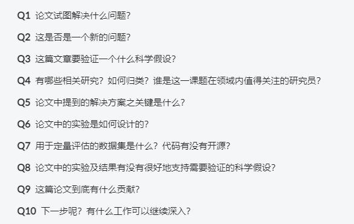

# 周计划

- [x] 开题报告
- [ ] 对Tile方法进行构建，并完成对test的实现

## 1. 开题报告

### 讨论：

1. 跟老师讨论后，对思路进行了清晰。
   $$
   &全图分类（针对特征提取进行改进）\rightarrow \\
   &病灶分割+TMB预测（主要利用弱监督进行，后续参考自然图像的方法）\rightarrow \\
   &构建图像块之间的联系以进一步提高预测（理想化）
   $$
   
2. 对问题的描述不够准确，对开题的思路也不够清晰，尽管之前有写笔记对看过的文献进行总结，但没有周期性的回顾，后续要改正。

## NSC论文和专利

- [x] 论文修改，之前进齐师兄提出的修改已经完成。（0623）
- [ ] 专利这周末完成。（0626）

## 2. 实习流程设计

### 2.1. 对Tile方法的构建

- [x] 预处理
  - [x] 切割
  - [x] 颜色归一化（近期加入，解决不同切片的染色问题和类型问题）
  - [x] shell编写
- [ ] tile方法构建
  - [x] dataset
  - [x] train
  - [ ] 调参
  - [x] test
  - [ ] shell
- [ ] MIL方法构建
  - [ ] dataset
  - [ ] train
  - [ ] 调参
  - [ ] test
  - [ ] shell

## 3. 其他

### 3.1. datawhale的C++课程

- [x] 基础部分完成
- [ ] 基础算法部分==（0704）==
- [ ] 数据结构部分
- [x] 在Linux搭建环境，加入opencv