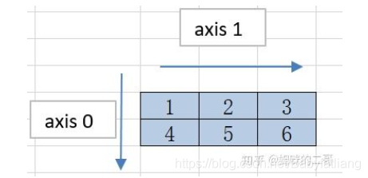

# 周总结

## 周目标

1. 公司总结：
   * ~~结果整理~~
   * ~~对中山医院数据的结果预测~~
2. cpp学习
   - [ ] 队列、栈
3. hubmap比赛的baseline
4. ~~论文修改~~

## 小总结

> 1. 完成在公司的工作，并写成文档。但由于docker版本等原因，并无法在他们那边使用。
> 2. 除了结论部分论文已经大致修改完，之前还是有很多错误的，机翻存在的问题还是很多。
> 3. 本周没有读论文

## 毕业项目

- [ ] 想法
  - [ ] 能不能用图网络来聚类，一个wsi可聚类成很多个图。然后再从这些图里选patch出来，进行后续的任务。
  - [ ] 其实上一步就是在做关键信息筛选，如何对关键patch进行筛选？
  
- [ ] 自监督总结

- [ ] Diagnostic Image Analysis Group这个实验室，属是牛逼

  - [ ] [结直肠癌patch分割](https://github.com/DIAGNijmegen/neural-odes-segmentation)
  - [ ] [WSI工具](https://github.com/DIAGNijmegen/pathology-whole-slide-data)

- [ ] 方法对比框架

  | Method                  | AUC  | Bib  |
  | ----------------------- | ---- | ---- |
  | MIL                     |      |      |
  | AttentionMIL            |      |      |
  | tile classification     |      |      |
  | graph convolution       |      |      |
  | graph convolution - MIL |      |      |
  |                         |      |      |

## 其他

### CPP

- [x] 报datawhale算法课程
- [x] 线性表
  - [x] 顺序表
  - [x] 单链表
  - [x] 双链表
- [ ] 栈
- [ ] 队列
- [ ] 树
- [ ] 优先级队列
- [ ] 哈希表
- [ ] 图
- [ ] 图的遍历

### 维度和长宽高的关系

> 在生成mask的时候一直报错

* axis=0是x轴、axis=1是y轴
* cv2, torch都是(H, W)
* open_slide的返回的是（w, h）

---

## To-Do

- [ ] python的正则化
- [x] docker学习
  - [x] 构建docker调用gpu、安装环境等

- [ ] 把config用yaml文件来写
- [ ] opencv获取np.ndarray的轮廓, mask....

