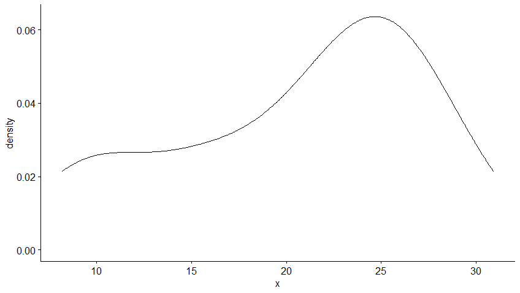
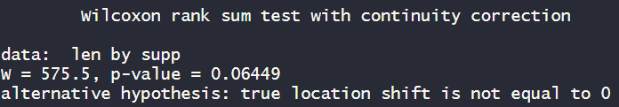

[TOC]


## 数据类型

### 1. table


## 关于显示窗口的代码

```R
rm(list=ls())   # clear environment

?method			# check the function
library(help='package')		# usage of pakeage

```

```R
getwd()
setwd()


```


## 假设检验

### 1. 样本独立性检验

#### 1.1. <a name="">卡方检验</a>

* 对二维表的**行变量和列变量**进行卡方独立性检验

* | <font color=Peru>$\Large p值$</font>: | 大于0.05,	两变量独立 | 小于0.05,    两变量不独立 |
  | ------------------------------------- | ----------------------- | ------------------------- |

* ```R
  > chisq.test(Arthritis$Treatment,Arthritis$Improved)
  
  	Pearson's Chi-squared test
  
  data:  Arthritis$Treatment and Arthritis$Improved
  X-squared = 13.055, df = 2, p-value = 0.001463
  												------ p值<0.05, 原假设不成立,i.e.两变量不互相独立
  ```

#### 1.2. 两样本均值是否有差异检验([正态性检验](#正态性检验) ----- [样本检验](#样本检验) ----- [数据分布+检验结果](#结合分布加检验结果)) 

* **$\Large 例子:$**	接受新药的患者较于接受另一药物的患者,  是否有更大改善?

   			  									  两种教学方法哪种更有效?

* **$\Large 步骤:$**([正态性检验](#正态性检验) ----- [样本检验](#样本检验) ----- [数据分布+检验结果](#结合分布加检验结果)) 

  1. <a name="正态性检验">正态性检验</a> 

     * 方法:

       * 图像:
       * 函数
         1. $\large Shapiro\_Wilk检验:$ **适用于样本量不太大的数据，在R中规定样本量在3-5000之间**
            * $\Large H_0: 假设研究对象符合正态分布$
            *  $ \LARGE 统计量:{W=\frac{\left(\sum_{i=1}^{n} a_{i} x_{i}\right)^{2}}{\sum_{i=1}^{n}\left(x_{i}-\bar{x}\right)^{2}}}$ 
            * W值越接近于1，且显著水平大于0.05时，我们就没法拒绝原假设, <font color=red> **i.e.$\large 不能拒绝H_0$**</font>。
  
     * 不满足正态分布$\Large \rightarrow \{wilcoxon检验\}$ `考虑是否满足参数检验方法t-test的假设条件（即正太分布或者样本总量很大（>30)，方差相同）`
  
     * 满足正态分布    $\Large \rightarrow \{t检验\}$ 
  
     * <font color=red>$\Large 观察分布的方法:$</font> (`ToothGrowth$supp`的`OJ`不满足正态分布,  `VC`满足正态分布)

       |                                  | $\Large 方法$ |                                                              |                                                              |
       | :------------------------------: | :-----------: | ------------------------------------------------------------ | ------------------------------------------------------------ |
       | $\Large 图形$  `library(ggpubr)` |   1. 密度图   | `ggdensity(ToothGrowth$len[ToothGrowth$supp == 'OJ'])`       |               |
       |                                  |               | `ggdensity(ToothGrowth,x='len', color = 'supp', fill = "supp",        palette = c('red','darkblue'), rug =T,  add = "median")` |  |
       |                                  |   2. 直方图   | `gghistogram(ToothGrowth,x= 'len',      color = 'supp',fill = "supp" ,        palette = c('grey','darkblue'),           rug =T,add = "median", bins=100)` |                         |
       |                                  |               | `ggqqplot(ToothGrowth,x= 'len',color ='supp')`<br />$\Large\text { 如果数据为正态分布, 散点应当落在第一象限的对角线附近。 }$ |                             |
       |          $\Large 函数$           | 统计检验函数  | `shapiro.test(ToothGrowth$len)`                              |  |
       |                                  |               | `shapiro.test(ToothGrowth$len[ToothGrowth$supp == "OJ"])`<br />等价于`shapiro.test(ToothGrowth$len[ToothGrowth$supp == "OJ"])` | <br /> |
  
  2. <a name="样本检验">样本检验:</a> 
  
     | 样本检验                                                     |                                                          |                                                              |                                                              |
     | ------------------------------------------------------------ | -------------------------------------------------------- | ------------------------------------------------------------ | ------------------------------------------------------------ |
     | 不满足正态分布$\Large \rightarrow \{wilcoxon检验\}$          |                                                          |                                                              |                                                              |
     | 考虑是否满足参数检验方法t-test的假设条件（即正太分布或者样本总量很大（>30)，方差相同） | <font color=red>**独立**</font>样本检验                  | `wilcox.test(len~supp,data =ToothGrowth,exact=F,alternative = 't')` |  |
     |                                                              | <font color=red>**配对**</font>样本检验                  | `wilcox.test(len~supp,data =ToothGrowth,exact=F,alternative = 'two.sided',paired = T) ` |  |
     |                                                              | <font color=red>**单**</font>样本检验                    | `wilcox.test(ToothGrowth$len,mu = 15, exact = F,alternative = 't')` |  |
     |                                                              |                                                          |                                                              |                                                              |
     | 满足正态分布    $\Large \rightarrow \{t检验\}$               |                                                          |                                                              |                                                              |
     |                                                              | [**方差齐性检验**](#方差齐性)--[`var.test`](#var.test()) | `var.test(len~supp,data =ToothGrowth)`<br />上面的方法仅能使用<u>**2**</u>组样本 |  |
     |                                                              | <font color=red>**独立**</font>样本检验                  | `t.test(len~supp,data =ToothGrowth,alternative = 't',var.equal=T) ` |  |
     |                                                              | <font color=red>**配对**</font>样本检验                  | 要求两组差值符合正态分布<br />`diff <- with(ToothGrowth,len[supp == "OJ"]-len[supp == "VC"])`<br />`shapiro.test(diff)`<br />`t.test(len~supp,data =ToothGrowth,alternative = 't',paired=T) ` | <br /> |
     |                                                              | <font color=red>**单**</font>样本检验                    | `t.test(ToothGrowth$len,mu = 15,alternative = 't')`          |  |
     
  3. <a name="结合分布加检验结果">$数据分布+检验结果$</a> 
  
     ````R
     # 作图
     ggboxplot(ToothGrowth,x="supp",y = 'len',color = 'supp',
               xlab = 'Supplements',ylab = "Tooth Length",title = "Tooth Growth") +
       stat_compare_means(method = "t.test",method.args = list(alternative = "g", var.equal =F),
                          label.x = 2,label.y = 38) 
     
     # 配对样本可以用ggpaired ,可以很好的展示各个样本前后变化关系
     ggpaired(ToothGrowth,x="supp",y = 'len',color = 'supp',
               xlab = 'Supplements',ylab = "Tooth Length",title = "Tooth Growth") +
       stat_compare_means(method = "t.test",method.args = list(alternative = "g", var.equal =F),
                          label.x = 2,label.y = 38) 
     
     
     # ggpar 把legend 挪到右侧
     P <- ggpaired(ToothGrowth,x="supp",y = 'len',color = 'supp',
                   xlab = 'Supplements',ylab = "Tooth Length",title = "Tooth Growth") +
       stat_compare_means(method = "t.test",method.args = list(alternative = "g", var.equal =F),
                          label.x = 2,label.y = 38)
     ggpar(P,legend = 'right'
           ,xlab = "Supplements",ylab = "Tooth Length"
           ,title = "Tooth Growth")
     ````
  
      

### 2. 方差分析(ANOVA)

[P198](#rf_1)

#### 2.1. <a name="方差齐性">方差齐性</a>

> **F检验**、**Bartlett卡方检验**对资料**正态性**要求苛刻，Leven检验可用于**任意分布**资料，是一种较为**稳健**的方差齐性检验方法

* $\large leveneTest:$ **非正态和正态数据均适用,  可以分析多组样本**
  * $\Large H_0: 假设研究对象方差齐性$
  *  $ \LARGE 统计量:{W=\frac{\left(\sum_{i=1}^{n} a_{i} x_{i}\right)^{2}}{\sum_{i=1}^{n}\left(x_{i}-\bar{x}\right)^{2}}}$ 
  * 
* 在样本量较大的时候我们可以用使用“K-S检验”

#### 2.2. 单因素方差分析(ANOVA)

* ANOVA ----- 残差方差分析 

* 组别差异分析,	组间因子,	(非)均衡设计--(观测样本量是否一致)

* |                                  | 方法                                                         | output                                                       |
  | -------------------------------- | ------------------------------------------------------------ | ------------------------------------------------------------ |
  | 正态分布,方差齐性                | `AOV1 <- aov(len~dosef,ToothGrowth)`<br />`summary(AOV1)`    |  |
  |                                  | 画图<br />`ggboxplot(ToothGrowth,x='dosef',y= 'len',fil='dosef',pallet='npg')`<br />`stat_compare_means(method='anova')` |  |
  |                                  | `comp <- list(c('0.5','1'),c('0.5','2'),c('1','2'))` <br/>`mytheme <- theme_classic2(base_size = 16)`<br /><br />`ggplot(ToothGrowth,aes(x=dosef,y=len,fill=dosef))+     stat_boxplot(geom='errorbar')+geom_boxplot()+ geom_point(size=2,alpha = 0.6)+ geom_signif(comparisons = comp, y_position = c(36,40,38), annotations = format(unname(P),scientific = T,digits=3))+ mytheme` |  |
  | 符合正态分布，**不符合方差齐性** | 使用welch ANOVA<br />`oneway.test(len~dosef,ToothGrowth,var.equal = F)`<br /> |                                                              |
  |                                  |                                                              |                                                              |
  | **不符合正态分布**               | 使用Kruskal wallis检验<br />                                 |                                                              |
  |                                  |                                                              |                                                              |

#### 2.3. 双因素方差分析

##### 2.3.1. 表达式

|      |      |
| ---- | ---- |
|      |      |
|      |      |
|      |      |
|      |      |

##### 2.3.2. 

### 3. 回归

#### 3.1. 线性回归

```R
fit <- lm(weight ~ height,data = women)		# weight和height的相关性
fit$coefficients							# 线性相关系数
summary(fit)
```

 

####  3.2. 多元回归分析

> 第一步最好检查一下变量间的相关性
>
>  

```R
#以基础包中的state.x77数据集为例，我们想探究一个州的犯罪率和其他因素的关系，
#包括 人口、文盲率、平均收入和结霜天数(温度在冰点以下的平均天数)。

#创建了一个名为states的数据框，包含了我们感兴趣的变量
states <- as.data.frame(state.x77[,c("Murder", "Population",
                                     "Illiteracy", "Income", "Frost")])
#多元回归分析中，第一步最好检查一下变量间的相关性。
#cor()函数提供了二变量之间的相 关系数.
cor(states)
#car包中scatterplotMatrix()函数则会生成散点图矩阵。
library(car)
scatterplotMatrix(states, spread=FALSE, smoother.args=list(lty=2),
                  main="Scatter Plot Matrix")
fit3 <- lm(Murder ~ Population + Illiteracy + Income + Frost, data=states)
summary(fit3)

# =============================== 结果 =============================== 
Call:
lm(formula = Murder ~ Population + Illiteracy + Income + Frost, 
    data = states)

Residuals:
    Min      1Q  Median      3Q     Max 
-4.7960 -1.6495 -0.0811  1.4815  7.6210 

Coefficients:
             Estimate Std. Error t value Pr(>|t|)    
(Intercept) 1.235e+00  3.866e+00   0.319   0.7510    
Population  2.237e-04  9.052e-05   2.471   0.0173 *  
Illiteracy  4.143e+00  8.744e-01   4.738 2.19e-05 ***
Income      6.442e-05  6.837e-04   0.094   0.9253    
Frost       5.813e-04  1.005e-02   0.058   0.9541    
---
Signif. codes:  0 ‘***’ 0.001 ‘**’ 0.01 ‘*’ 0.05 ‘.’ 0.1 ‘ ’ 1

Residual standard error: 2.535 on 45 degrees of freedom
Multiple R-squared:  0.567,	Adjusted R-squared:  0.5285 
F-statistic: 14.73 on 4 and 45 DF,  p-value: 9.133e-08
#结果解释
#文盲率上升1%，谋杀率将会上升4.14%，它的系数在p<0.001的水平下显著不 为0。
#相反，Frost的系数没有显著不为0(p=0.954)，表明当控制其他变量不变时，
#Frost与Murder 不呈线性相关。
#总体来看，所有的预测变量解释了各州谋杀率57%的方差。
# =============================== 结果 =============================== 
```

## 降维

## <span style=color:red>$\Large 画图$</span>

### 1. ggplot

```R
ggplot(data=pca.data,aes(x=X,y=Y,label=Sample)) +				# 输入数据以及横纵坐标范围, z
	  geom_text()+	 
	  xlab(paste("PC1 - ", pca.var.per[1],"%",sep=""))+
	  ylab(paste("PC2 - ", pca.var.per[2],"%",sep=""))+
	  theme_bw()+
	  ggtitle("PCA Graph")
```


## 函数

### var.test()

* 函数体

```R
# F检验方法
# Performs an F test to compare the variances of two samples from normal populations.

var.test(x, ...)
## Default S3 method:
var.test(x, y, ratio = 1,
         alternative = c("two.sided", "less", "greater"),
         conf.level = 0.95, ...)

## S3 method for class 'formula'
var.test(formula, data, subset, na.action, ...)
```

> `x,y` ：为进行检验的数据。
> `alternative`：设定备择假设，包括"two.sided" (default), "greater" or "less"。
> `conf.level`：设定显著性水平，默认α=0.05。

* 输出结果
  * F检验统计值，包括两样本分别的自由度和p-value
    备择假设
    置信区间
    方差比值
  * $\Large p-value$大于**0.05**,   i.e. 两组方差同质(齐性)

## 自带数据集

### Arthritis

 ```
 ID  Treatment   Sex      Age        Improved
 1	57	Treated	    Male	 27			Some
 2	46	Treated 	Male	 29			None
 3	77	Treated 	Male	 30			None
 4	17	Treated 	Male	 32			Marked
 5	36	Treated 	Male	 46			Marked
 6	23	Treated 	Male	 58			Marke
 ```

## Reference

<a name="rf_1">[1]</a>> R语言实战 第二版 王小宁译
