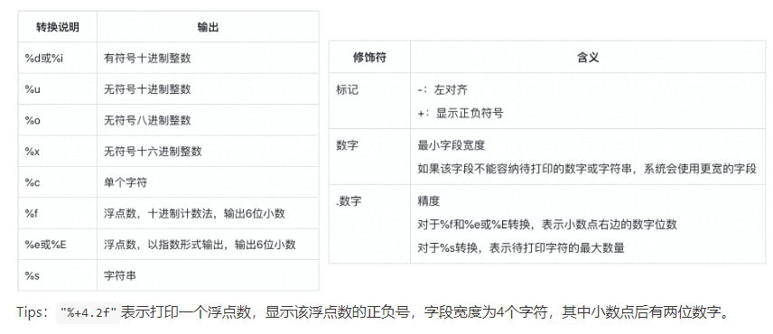
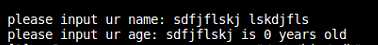
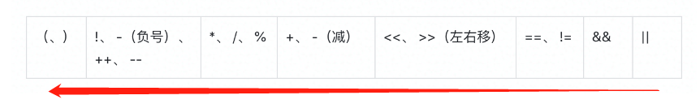
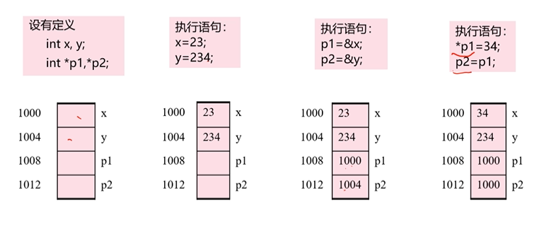

# 1. 基础


## 1.1. 变量、常量

```c++
#include <iostream>	// cout, cin
#include <cstdio>	// printf
using namespace std; // 类似于python中import numpy as np
```

* 每个变量\常量都必须给一个数据类型，计算机根据这个开辟存储空间，例`int name;`
* 变量名的命名规则跟python差不多
* 常量必须要**初始化**，例`const int kName = 11`

### 1.1.1. 整数

#### 数值整数类型

* 占用内存大小:

  * `short` $\rightarrow$  2个字节
    `int` $\rightarrow$  4个字节
    `long` $\rightarrow$  4个字节
    `long long` $\rightarrow$  8个字节
* 一个字节(byte) = 8位(bit) = 2^8^
    * 例如字符类型`char a = 7`：它的大小即为`一个byte`，且对应的bit为`0000 0111`

* 有无符号
  * `signed int price = 500`;: 即 $\{2^{-16} - (2^{16}-1)\}$
  * `unsigned int price = 500;`: 即$\{0 - (2^{32}-1)\}$ *只能为正数*

####  字符整数

* 专门用来存储计算机中的基本符号：**英文字母、数字以及标点**等，用ASCII表示
* 给`char`赋值的方式：
  * 字符常量：`char size_1 = 'L';`
  * 整数常量：`char size_1 = 76;`

### 1.1.2.  浮点数

* 不同精度表示（浮点数的精度在于它可以表示的**有效位数**以及**指数范围**）
  * `float`类型通常占用4个字节，有效位数为6位
  * `double`类型占用的空间是`float`类型的两倍，即8个字节，有效位数为15位
  * `long double`类型一般占用16个字节的空间

### 1.1.3.  输入输出

* **格式化**和**流数据**

#### 格式化

* 头文件

  ```c++
  #include<cstdio>
  #include<iostream>
  using namespace std;
  
  int main()
  {
      // TODO: 输出
      string name = "chenlinghao";
      int old = 18;
      printf("Output String: My name is %s, im %d year old.", name, old);
  
      // TODO: 输出
      char name;
      int old;
      scanf("Please input ur name: %s", &name);
      scanf("Please input ur old: %d", &old);
      printf("Through complex calculation: My name is %s, im %d year old.", name, old);
  }
  ```

* 格式化转换表格

#### 流(Stream)

* ```c++
  #include<iostream>
  #include<string>
  using namespace std;
  
  int main()
  {
      string name = "chenlinghao";
      int old;
  
      cout << "My name is " << name << endl;
      cout << "please input ur age: 10";
      cin >> old;
      cout << name << "is " << old << " years old" << endl;
      return 0;
  }
  ```

* 从流中提取数据时，通常会跳过输人流中的**空格**、**制表符**、**换行符**等空白字符。只有在输入完数据再按**回车键**后，这一行数据才会形成输入流，进而被运算符提取。

  * 当输入带有空格时候，它就会忽略后续的输入 

## 1.2. 运算

==优先级：==



### 1.2.1. 加减乘除、求余

* `+-*/%`基本上都跟python差不多
  * ==注意==：
    * 当`\`运算时，如果两边操作数都为整数，则输出也为整数
    * `%`需要为整数


  ```c++
  int a = 32;
  int b = 5;	
  
  cout << a / b;
  cout << a % b;
  >>> 6
  >>> 2
  ```

* 自增运算、自减运算

  * 有`前缀`自运算和`后缀`自运算，两种运算的区别在于：前者在赋值前即进行运算，后者是在赋值后才进行运算
  
  ```c++
  int a = 10;
  a = a++;
  a = ++a;

####   1.2.2. 位运算

* `& | ^ ~ << >>`：与、或、异或、取反、左移、右移
* 移位优先级高于异或

#### 1.2.3. 关系逻辑符

* **逻辑表达式**用于连接关系表达式**判断更复杂的条件是否成立**，常用的逻辑运算符**`&&`、`||`、`!`、`<<`、`>>`**


### 1.3. 逻辑控制

#### 1.3.1. `if`

```c++
// 当运行体内只有一条语句的时候，可以不加{}
if (条件成立_1){
    运行
}
else if (条件成立_2){
    ...
}
else{
    ...	//以上都不成立
}
```

#### 1.3.2. `switch`

> 如果`case`内没有加`break;`，在执行完case后，会自动运行后续的case。所以必须要加`break;`

```c++
int a;
cin >> a;

switch (a){
    case 1: {
        cout << "condition 1" << endl;
        break;
    }
    case 2: {
        cout << "condition 2" << endl;
        break;
    }
    case 3: {
        cout << "condition 3" << endl;
        break;
    }
    default: {
        cout << "conditions above perhibit";
    }
}
```

#### 1.3.3. `for`、`while`

> 除了条件控制的位置，其他都跟python差不多

```c++
for (control variable; loop condition; renew variable){
    loop boby
}

while (condition){
    loop body
}
```

## 2. 数据结构

### 2.1. 基本结构

### 2.1.1. 数组

* 数组和地址的关系
  * 数组名代表的是数组存放的地址
* 与`python`的区别：
  * c++中只能存放一种数据类型、python则可以存放多种数据类型
  * 前者需要提前确定数组长度、后者不需要
  * 前者初始化用`{{...}, {...}, ...}`实现，后者用`[...]`
  * **如果访问超过了长度**：前者会直接报错，后者则默认读最后一个
* 数组声明的三种方式：
  1. 声明行列
  2. 行列都不声明
  3. 只声明列
  4. ~~只声明行~~

### 2.1.2. string

* 空字符串也占`一个字节`。
* ==Tips：==在 C++ 中，`'a'` 和 `"a"` 是不一样的，
  * 前者是一个字符常量，在内存中占 1 字节，
  * 后者是一个字符串，占 2 字节的空间，第 1个字节储存了字母 `a` 的内码值，第2个字节储存了 `'\0'`。


#### 初始化

```c++
// 直接指定每个位置的值，跟数组类似，没被赋值的位置将被分配\0
char userName[11] = {'L', 'a', 'o', 'W', 'a', 'n', 'g', '\0'};
char userName[11] = {'L', 'a', 'o', 'W', 'a', 'n', 'g'};
char userName[] = {'L', 'a', 'o', 'W', 'a', 'n', 'g', '\0'};
```

```c++
//直接用字符串来初始化
char userName[] = "LaoWang";
```

#### 输入输出

```c++
char c='a';
char s="string";

// 对比字符与字符串的输入输出
// 前者需要地址符，后者不需要
scanf("%s", &c);
scanf("%s", s);

// 当输出命令遇到`\0`时，就停止输出
```

#### 字符串操作（后续具体任务再补充，针对String对象）

```c++
// TODO: 连接、长度、比较、复制

// 使用char
strcat(s1, s2);
strlen(s1);	// 返回不包含`\0`的长度
strcmp(s1, s2);
strcpy(s1, s2);
strncpy(s1, s2[0], s2[3]); 
```

```c++
// 用string对象(标准库)来处理
#include <string>
string name="chenlinghao";
string age="_18";

str = name + age;

cout << str << endl;
cout << str.length() << endl;
cout << str.size() << endl;
cout << (name > age) << endl;
```


### 2.1.3. 函数和结构体

#### 函数

* 函数定义==不可以==嵌套，调用可以
* 传值传递和引用传递
  * ==传值==是将值传到了形参中；==引用==传递则是参数的引用赋值传给形参，后续在函数中如果形参进行更改，**修改形式参数会影响实际参数**。
* 递归调用
  * 函数 funA 调用了函数 funB, 函数 funB 又调用了函数 funA 


#### 递归

* 需要一个终止条件，即最开始的条件

* ==例子==

  ```c++
  // Hannoi
  void hannoi(int n, char src, char middle, char dst){
      // TODO: 先将上面n-1个移动到middle去，然后把最后一个移动到dst中。思想类似于，如何把大象放到冰箱中，打开冰箱，放进去，关上冰箱。
      // :param n: 一共需要移动的块
      // :param src: 出发地址
      // :param midel: 桥梁
      // :param dst: 目标地址
      
      // basic condition
      if (n == 1){
          printf("%c -> %c\n", src, middle, dst);
          return;
      }
      
      // recurrence
      hannoi(n-1, src, dst, middle);
      printf("%c -> %c\n", src, dst, middle);
      hannoi(n-1, middle, src, dst);    
  }
  ```

#### 结构体

* 使用**结构体**来**将一组不同类型的数据聚合成一个整体**，以便于去处理这些信息。

  * 人话：把不同类型的数据打包在一起，方便以后调用

* ```c++
  struct Student{
      int number, birth_year;
      string name;
  }; //不要忘记最后的'；'!!!!!
  ```

* 传值传递和引用传递
  * ==传值==是会生成结构体的副本，如果是大的结构体，会产生时间和空间的极大占用

* 初始化:

  ```c++
  #include<iostream>
  #include<string>
  using namespace std;
  
  // 变量声明：在声明结构体后面直接声明
  struct Student{
      int number, age;
      string name;
  } students[100];
  
  struct Student{
      int number, age;
      string name;
  } chenglinghao, zhangsan, lisi, wangwu;
  
  void showStudent(const Student &student_info){
      cout << "student name: " << student_info.name << endl;
      cout << "student age: " << student_info.age << endl;
      cout << "student number: " << student_info.number << endl;
  }
  
  
  // 初始化1：直接初始化
  zhangsna = {1, 18, "zhangsan"};
  cout << "初始化方法 1" << endl;
  showStudent(zhangsan);
  
  // 初始化2: 在结构体内写构造函数，这样在声明结构体变量的时候，有些不设置的参数可以使用默认值
  struct Student{
      int number, age;
      string name;
      
      Student (int num=0, string n=""){
          number = num;
          name = n;
          age = 18;
      }};
  Student zhangsan = {1, "zhangsan"}
  ```
  

##  3. 结构化编程

* 枚举类型`enum`
  * 大括号`{}`中是一个用逗号分隔的标识符列表。标识符由字母（A-Z，a-z）、数字（0-9）、下划线“_”组成，并且`首字符不能是数字`。

### 3.2. 头文件

* 作用：

  * 声明函数，并介绍功能和使用方法
  * 自己的头文件用`""`来引用，`·<>`表示的是c++标准库的文件

* 预处理

  * 预处理 = 一些指令组成。

  * 预处理器指令都是`#`开头

    ```c++
    // 头文件
    // 预先编译一些指令，如函数声明等，这样在编译源文件的时候就不用继续声明一个函数(具体有什么效果还没使用过，后续补充)
    
    // 为了避免重复编译指令而造成冲突，有两种方法可以规避这个问题
    // 方法一：
    #ifndef _NAME_H
    #define _NAME_H
    
    #include <iostream>
    #include <ctime>
    int a;
    int b;
    
    enum foods {eggs, apple, orange};
    void showFoods(int names);
    #endif
    
    // 方法二: 
    #pragma once // 在源文件前面加上这句就可以了
    ```

    

    * `#include`：包含指令。将头文件包含到源文件
    * `#defin`：创建符号常量，通常将符号常量成为`宏`
    * `#if`、`#else`：条件编译

* 学习链接
  * [【10】【Cherno C++】【中字】C++头文件_哔哩哔哩_bilibili](https://www.bilibili.com/video/BV1xa4y1W7Rq?spm_id_from=333.337.search-card.all.click&vd_source=4719b6e70f3a964550b368f8e6724d79)

## 4. 指针

* 计算机有内存，数据存在内存里，用内存地址找到数据存放的位置，`指针 -> 变量存放的地址`

### 4.1. 基础使用

```c++
int a, b;
int *ptr_a, *ptr_b;

// 初始化
a = 1; b = 2;
ptr_a = &a; ptr_b = &b;

// 
cout << "ptr_a -> " << *ptr_a << endl;
cout << "ptr_b -> " << *ptr_b << endl;

*ptr_a = 20;	// 将a的值改成20
ptr_a = ptr_b	// 将ptr_a的指针指向b的地址，即两个指针同时指向b
```



### 4.2. 动态内存分配

* 当不知道你要的变量需要多大的内存空间时，可以申请一块内存空间给这个变量，这里就需要用到**指针**，指针指向的是该变量的内存首地址
* 申请了动态内存必须释放，需要注意的是对于数组的动态内存释放
  * 正确：`delete [] p;`
  * 错误：`delete p;` 如果p指向的是一个数组，该方法只会释放数组的第一个元素，后面都没有被释放，这种情况被称作为==内存泄露==。如果运行的程序很大，泄露过多则把内存占满，导致程序无法运行等问题。
  * 对于一个字符数组，c++会将其看成一个字符串，会自动全部释放掉。

```c++
// 申请动态变量
int *p;

p = new int;			// 变量
p = new int [10];		// 数组
p = new int (10);		// 变量初始化
p = new int[10] {0, 1, 2, 3, 4, 5, 6, 7, 8, 9};	// 数组初始化

// 释放动态变量
delete p;
delete [] p;
```

### 4.3. 字符串

```C++
// 初始化字符串

// 1. 将字符串"chenlinghao"的首地址给String
// 该种方法对后续操作有限制，它无法像后两个方法一样用数组的方式来获取某个元素，因为”chenlinghao“是一整个常量，常量是无法修改的。（可否理解成类似与const？）
char *String;
String = "chenlinghao";

// 2. 与上面是一个意思
char *String, ss[] = "chenlinghao";
String = ss;

// 3. 先用指针指向一个动态内存数组的首地址，然后再用strcpy函数copy到String中
char *String;
String = new char[10];
strcpy(String, "chenlinghao");
```

### 4.4. 函数

* 当参数用指针作为输入的时候，参数不仅可以当作输入，还可以**<u>当作输出</u>**。因为指针是直接代表值的存放地址，在函数中能够直接找到参数对应值的存放地址，直接修改即可。

* 引用：

  ```c++
  int i=10086;
  int &j = i;		//  i j指向同一个地址
  
  int &h;			//	错误！引用必须初始化
  
  const &j = i;	//	将j引用为一个常量
  const &j = i+5;	//	在用作常量时，可以进行修改
  int &j = 2+5;	//	错误！j引用的初值需要是《常量、表达式》
  
  // 对于函数的使用也是一样的，两个返回的都是func的指针(引用)
  int *func();
  int &func();
  ```

  * 相比于指针，==引用==的使用更加简洁，并能够节省内存的开销（指针需要拷贝）。

### 4.n. 注意事项

1. 指针的类型和变量的类型必须一致，否则在解引用的使用获取到的就不是想要的值


###

* 学习链接
  * [【16】【Cherno C++】【中字】C++指针](https://www.bilibili.com/video/BV1Nt4y1k7sC/?spm_id_from=333.788&vd_source=4719b6e70f3a964550b368f8e6724d79) --------- 简单易懂

## 5. 类和对象

### 5.1. 构造和析构

* 构造函数和析构函数与类名相同
* 构造函数`Player(int input_x, int input_y){...}`
* 析构函数`~Player(){delete ...}`：如果有动态内存，则会自己释放掉

```c++

```

### 5.2. 重载

* 在同一个程序中，可以有多个同名函数，但这几个函数的参数必须不一样，这也程序才能识别并重载
* 
