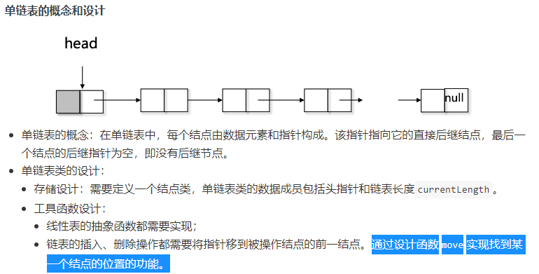
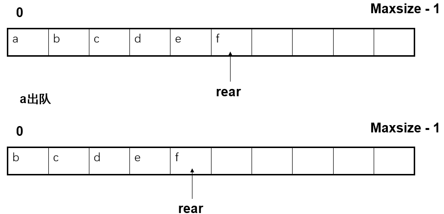
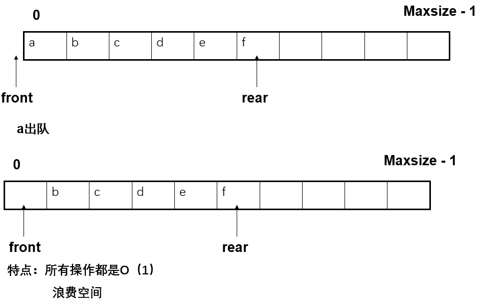
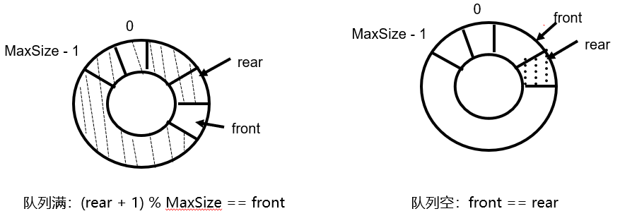

#  背景

## 存储方式

1. 顺序存储：数组，可以通过下标找到
2. 链接存储：单链表，用指针显式地指出元素之间的关系
3. 哈需存储：用存储位置表示元素之间的关系
4. 索引存储：索引区和数据区

# 数据结构

## 一、顺序结构

###  基本模板类：线性表

* 抽象类

```c++
template <class elemType>
class list {
  public: 
     // 清除
     virtual void clear() = 0;
     // 长度
     virtual int length() const = 0;
     // 插入
     virtual void insert(int i, const elemType &x) = 0; 
     // 删除
     virtual void remove(int i) = 0;
     // 搜索
     virtual int search(const elemType &x) const = 0;
     // 访问
     virtual elemType visit(int i) const = 0;
     // 遍历
     virtual void traverse() const = 0;
     // 析构
     virtual ~list() {};
};
```

* 线性表的抽象类定义虚析构函数
  * 虚析构函数是为了解决父类指针指向子类对象时，释放子类对象的资源时，释放不完全，造成的内存泄漏问题。
* 基本操作
  - **创建**空的线性表
  - **清除**所有元素
  - 求线性表的**长度**
  - 在第i个位置**插入**一个元素
  - **删除**第i个位置的元素
  - **搜索**某个元素在线性表中是否出现
  - **访问**线性表的第i个元素
  - **遍历**线性表

### 1. 顺序表

* 顺序表比较适合**静态的**、**经常做线性访问**的线性表
  * 

#### --- 类模板 ---

```c++
template <class elemType>
class seqList: public list<elemType> { 
private:
    elemType *data;
    int currentLength;
    int maxSize;
    void doubleSpace();	// 为了解决插入元素时，数组容量不够的问题
public:
    seqList( int initSize = 10 );
    // 析构函数：还掉动态空间
    ~seqList( )  {  delete [] data;  }
    // 清空数组元素：只要把表长设为0
    void clear( )  {   currentLength = 0;   }
    // 数组长度：只需要返回这个私有成员变量currentLength
    int length( ) const  {   return currentLength;   }
    void insert( int i, const elemType &x); 
    void remove( int i );  
    int search( const elemType &x ) const ;
    // 访问数组元素：返回下标为i的数组元素
    elemType visit( int i) const { return data[i]  ; }
    void traverse( ) const ;
};
```

#### 构造函数

```c++
template <class elemType>
seqList<elemType>::seqList(int initSize) {
    data = new elemType[initSize]; 
    maxSize = initSize; 
    currentLength = 0;
} 
```

#### search

```c++
template <class elemType>
int seqList<elemType>::search (const elemType &x) const {
    int i;
    // 空循环，不满足循环条件时跳出
    for (i = 0; i < currentLength && data[i] != x; ++i) ;
    if (i == currentLength)
        return -1; 
    else return i;
}
```

#### traverse

```c++
template <class elemType>
void seqList<elemType>::traverse() const {
    cout << endl;
    for (int i = 0; i < currentLength; ++i) 
        cout << data[i] << ' ';
}
```

#### insert(i, x)

```c++
template <class elemType>
void seqList<elemType>::insert(int i, const elemType &x) {
    // 如果数组放满了，先扩大数组空间
    if (currentLength == maxSize) 
        doubleSpace(); 
    // 从后往前，元素后移
    for ( int j = currentLength; j > i; j--) 
        data[j] = data[j-1];
    // 空出空间，插入元素，表长加1
    data[i] = x;
    ++currentLength;
}
```

#### doubleSpace

```c++
template <class elemType>
void seqList<elemType>::doubleSpace() { 
    // 保存指向原来空间的指针
    elemType *tmp = data;
    // 重新申请空间
    maxSize *= 2;
    data = new elemType[maxSize];
    // 拷贝原有数据
    for (int i = 0; i < currentLength; ++i) 
        data[i] = tmp[i];
    // 清除原来申请的空间
    delete [] tmp;
} 
```

#### remove(i)

```c++
template <class elemType>
void seqList<elemType>::remove(int i) {
    // 后面所有元素前移，表长减1
    for (int j = i; j < currentLength - 1; j++) 
        data[j] = data[j+1] ;
    --currentLength;
} 
```

### 2. 单链表



* 单链表节点中指针的作用是什么？为什么顺序表不需要指针？
  * 单链表节点中指针的作用是指向当前节点的后驱节点，如果指针为空说明无后驱。 顺序表中存储数据的物理地址是连续的，故无需指针便可查找到后驱节点。
* 头指针的作用？
  * 以确定线性表中第一个元素对应的存储位置。

#### --- 类模板 ---

```c++
template <class elemType>
class sLinkList: public list<elemType> { 
    private:
        // 定义一个结点的结构体，里面的所有成员都是公有的
        struct node {                                  
            elemType data;
            node *next;
            node(const elemType &x, node *n = NULL) { data = x; next = n; }
            node( ):next(NULL) { }
            ~node() {};
        };
 
        node  *head;             // 定义头节点                            
        int currentLength;                                  
        node *move(int i) const;                  

    public:
        // 构造函数：创建空的单链表
        sLinkList() { 
            head = new node;
            currentLength = 0;
        }
        // 析构函数：调用clear把单链表的所有结点都还掉，再把头结点还掉
        ~sLinkList() { clear(); delete head; } 
        void clear() ;
        // 表的长度：返回私有的成员变量
        int length() const { return currentLength; }
        void insert(int i, const elemType &x); 
        void remove(int i);  
        int search(const elemType &x) const  ;
        elemType visit(int i) const;
        void traverse() const ;  
}; 
```

#### clear

```c++
// 把单链表变成一个空表。注意需要把所有结点的空间还给系统。
template <class elemType>
void sLinkList<elemType>::clear(){
    node *p = head->next, *q;
    head->next = NULL;
    
    while(p != NULL){
        q = p->next;
        delete p;
        p = q;
    }
    currentLength = 0;
}
```

#### insert(i, x)

```c++
// 在第i个位置插入元素x。先让指针指向第i-1个元素，之后执行插入过程，即申请一个存放x的结点，让该结点的后继指针指向结点i，让第i-1个结点的后继指针指向这个新结点
template <class elemType>
void sLinkList<elemType>::insert(int i, const elemType &x){
    node *pos;
    
    // 通过move函数找到第i-1个元素的地址
    pos = move(i-1);
    pos->next = new node(x, pos->next);
    ++currentLength;
}
```

#### ==move==

```c++
// 返回指向第i个元素的指针。
template <class elemType>
sLinkList<elemType>::node * sLinkList<elemType>::move(int i) const {
    node *p = head;  
    while (i-- >= 0) p = p->next;
    return p;
}
```

#### remove

```c++
// 删除第i个位置的元素。先找到第i-1个结点，让该结点的后继指针指向第i+1个结点，释放被删结点空间
template <class elemType>
void sLinkList<elemType>::remove(int i) {
    node *pos, *delp;
    
    // 通过move函数找到第i-1个元素的地址
    pos = move(i - 1);
    // 找到被删结点的位置，让第i-1个元素的后继指针指向第i+1个结点
    delp = pos->next;
    pos->next = delp->next;
    // 释放被删结点的空间
    delete delp;
    --currentLength;
}
```

#### search

```c++
// 搜索某个元素在线性表中是否出现。从头指针的后继结点开始往后检查链表的结点直到找到x或查找到表尾。
template <class elemType>
int sLinkList<elemType>::search(const elemType &x) const {
    // 指针指向第一个元素A_0
    node *p = head->next;
    
    int i = 0;
    while (p != NULL && p->data != x) {
        p = p->next; 
        ++i;
    }
    // p为NULL表示找到表尾都没有找到
    if (p == NULL)
        return -1;
    else 
        return i;
}
```

#### visit

```c++
// 访问线性表的第i个元素。通过move(i)找到第i个结点，返回该结点的数据部分
template <class elemType>
elemType sLinkList<elemType>::visit(int i) const {
    return move(i)->data;
}
```

#### traverse

```c++
// 遍历运算。从头结点的直接后继开始重复：输出当前结点值，将后继结点设为当前结点，直到当前节点为空。
template <class elemType>
void sLinkList<elemType>::traverse() const {
    node *p = head->next;
    cout << endl;
    while (p != NULL) {
        cout << p->data << "  ";
        p=p->next;
    }
    cout << endl;
}
```

### 3. 双链表

#### --- 类模板 ---

```c++
template <class elemType>
class dLinkList:public list<elemType> {
    private:
    	// 定义节点类, struct将node内部变成公有, 但node是私有.(有点疑惑)
    	struct node{
            elemType data;	// 节点值
            node *prev, *tail;
            node(const elemType &x, node *p=NULL, node *n=NULL) {
                data = x;
                next = n;
                prev = p;
            }
            ~node(){}
        };
    
    	node *head, *tail;
    	int currentLength;
    	node *move(int i) const;
	
    public:
    	dLinkList();
    	~dLinkList() {
            clear();
            delete head;
            delete tail;
        }
    	void clear();
    	int length() const{return currrentLength;}
    	void insert(int i, const elemType &x);
    	void remove(int i);
    	int search(const elemType &x) const;
    	elemType visit(int i) const;
    	void traverse() const;
};
```

#### - 构造函数 -

```c++
template <class elemType>
void dLinkList<elemType>::dLinkList(){
    head = new node;
    head->next = tail = new node;
    tail->prev = head;
    currentLength = 0;
}
```

#### insert

```c++
template <class elemType>
void dLinkList<elemType>::insert(int i, const elemType &x) {
    node *pos, *tmp;

    pos = move(i);                  
    tmp = new node(x, pos->prev, pos);
    pos->prev->next = tmp;        
    pos->prev = tmp;            

    ++currentLength;
}
```

#### remove

```c++
template <class elemType>
void dLinkList<elemType>::remove(int i) {
    node *pos;

    pos = move(i);                       
    pos->prev->next = pos->next;           
    pos->next->prev = pos->prev;

    delete pos;
    --currentLength;
}
```

## 二、栈

### 1. 顺序栈

#### --- 类模板 ---

```c++
template <class elemType>
class seqStack: public stack<elemType>{
    private:
        elemType *elem;
        int top_p;
        int maxSize;
        void doubleSpace();
    public:
        seqStack(int initSize = 10)；
        // 析构函数
        ~seqStack() { delete [] elem; }
        // 判断栈是否为空，若top_p的值为-1，返回true，否则返回false。
        bool isEmpty() const { return top_p == -1; }      
        void push(const elemType &x) ；
        // 出栈：返回栈顶元素，并把元素数量减1
        elemType pop() { return elem[top_p--]; }
        // top：与pop类似，只是不需要将top_p减1
        elemType top() const { return elem[top_p]; }
}；
```

#### 构造函数

```c++
template <class elemType>
seqStack<elemType>::seqStack(int initSize) {
    elem = new elemType[initSize];
    maxSize = initSize ;
    top_p = -1;  
}
```

#### push(x)：

* 将top_p加1，将x放入top_p指出的位置中。但要注意数组满的情况

```c++
template <class elemType>
void seqStack<elemType>::push(const elemType &x) { 
    if (top_p == maxSize - 1)
        doubleSpace();
    elem[++top_p] = x; 
}
```

### 2. 链接栈

#### --- 类模板 ---

```c++
template <class elemType>
class linkStack: public stack<elemType> {
    private:
        struct node {
            elemType  data;
            node *next;
            node(const elemType &x, node *N = NULL) { 
                data = x; 
                next = N;
            }
            node():next(NULL) {}
            ~node() {}
        };

        node *top_p;
        
    public:
        // 构造函数：将top_p设为空指针
        linkStack() { top_p = NULL; }	   
        ~linkStack();
        // isEmpty()：判top_p是否为空指针
        bool isEmpty() const { return   top_p == NULL; }
        // push(x)：在表头执行单链表的插入。
        void push(const elemType &x) { op_p = new node(x, top_p); }
        elemType pop();
        // top()：返回top_p指向的结点的值。
        elemType top() const { return top_p->data; }	
```

#### 析构函数：

- 注意需要释放空间。

```c++
template <class elemType>
linkStack<elemType>::~linkStack() {
    node *tmp;

    while (top_p != NULL) {
        tmp = top_p; 
        top_p = top_p ->next;
        delete tmp;
    }
}
```

#### pop()：

* 出栈操作，在表头执行单链表的删除。

```c++
template <class elemType>
elemType linkStack<elemType>::pop() {
    node *tmp = top_p;
    elemType x = tmp->data;              

    top_p = top_p->next;                   
    delete tmp;                          
    return x;
} 
```

## 三、队列

### 1. 顺序队列

* 顺序队列也是通过一个`数组`来实现

* 节点个数最多为`MaxSize`个，下标范围从`0`到`MaxSize-1`

* 组织方式：

  1. 队头位置固定`O(N)`
  2. 队头位置不固定`O(1) 浪费空间`
  3. 循环队列`空间时间的复杂度都是O(1)`

  

* 实现`仅循环队列`：

  ```c++
  template <class elemType>
  class seqQueue: public queue<elemType> {
      private:
          elemType *elem;
          int maxSize;
          // 队头和队尾
          int front, rear;
          void doubleSpace();
      public:
          seqQueue(int size = 10)；
          // 析构函数：收回动态数组
          ~seqQueue() { delete [] elem ; }
          // 判队列是否为空：队头是否等于队尾
          bool isEmpty() { return front == rear; }
          void enQueue(const elemType &x);
          elemType deQueue();
          // 访问队头元素
          elemType getHead() { return elem[(front + 1) % maxSize]; }
  };
  
  // 构造函数
  template <class elemType>
  seqQueue<elemType>::seqQueue(int size) { 
      elem = new elemType[size];
      maxSize = size; 
      front = rear = 0;
  } 
  
  // 入列
  template <class elemType>
  void seqQueue<elemType>::enQueue(const elemType &x){
      if ((rear+1)%maxSize == front) doubleSpace();
      rear = (rear+1) % maxSize;
      elem[rear] = x;
  }
  
  // 出列
  template <class elemType>
  elemType seqQueue<elemType>::deQueue(){
      front = (front+1) % maxSize;
      return elem[front]
  }
  
  // doublespace
  template <class elemType>
  void seqQueue<elemType>::doubleSpace(){
      elemType *tmp = elem;
      elem = new elemType[maxSize*2];
      for (int i=0; i<maxSize; i++){
          elem[i] = tmp[(front+1) % maxSize];
      }
      
      front = 0;
      rear = maxSize - 1;
      maxSize *= 2;
      delete [] tmp;
  }
  ```

### 2. 链接队列

* 实现

  ```c++
  template <class elemType>
  class linkQueue: public queue<elemType>{
      private:
      	struct node{
              eleType data;
              node *next;
              node(const elemType &x, node *N = NULL){data=x; next=N;}
              node():next(NULL){}
              ~node(){}
          };
      node *front, *rear;
      
      public:
      	linkQueue(){front = rear = NULL;}
      	~linkQueue();
      	bool isEmpty(){return front == NULL;}
      	void enQueue(const elemType &x);
      	elemType deQueue();
      	elemType getHead(){return front->data;}
  }
  
  // 入列
  template <class elemType>
  void linkQueue<elemType>::enQueue(const elemType &x){
      if (rear == NULL){
          front = rear = new node(x);		 	// 给空队列增加第一个元素
      }
      else{
          rear = rear->next = new node(x);	// 正常情况
      }
  }
  
  // 出列
  template <class elemType>
  elemType linkQueue<elemType>::deQueue(){
  	node *tmp = front;
      elemType value = front->data;
      front = front->next;
      delete tmp;
      
      // if null
      if (front==NULL) rear = NULL;
      return
  }
  ```
  

### 3. 应用

#### 3.1. 车厢重排

#### 3.2. 字符串

* 
