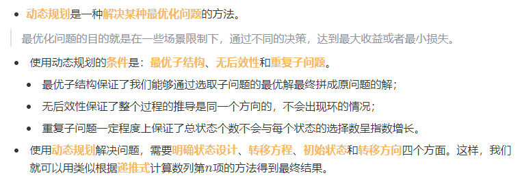
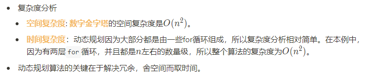

算法

## 1. 算法基础

### 1.1. 模拟和高精度

#### 1.1.1. 单精度和高精度

* `单精度`：可以用内置的数据类型存储的整数
* `高精度`：用内置的数据类型已经存储不下了，要用数组来存储每个数位

#### 1.1.2. 大端序和小端序

* `大端序`：数字高位 对应 地址地位
* `小端序`：数字高位 对应 地址高位


 

#### 1.1.3. 高精度运算

##### 加法

```c++
// 高精度运算 -- 加法
#include <bits/stdc++.h>
#define N 110
using namespace std;
// 这里我们采用直接赋值的形式初始化，按照小端序的方式存储
// 所以这里加数a = 368， 加数b = 997，
// 感兴趣的话也可以按照之前介绍的方式改成手动输入
int a_digits[N] = {8, 6, 3}, a_len = 3;
int b_digits[N] = {7, 9, 9}, b_len = 3;
int ans_digits[N], ans_len;

int main() {
    // 1. 数位操作:     
    ans_len = max(a_len, b_len);  // 初始长度
    int k = 0;                    // 记录进位的变量
    for (int i = 0; i < ans_len; ++i) {
        // 假设a_len > b_len，这里需要保证b[b_len]到b[a_len - 1]的位置都是0，否则可能会出错。
        // TODO 请补全下述代码
        ans_digits[i] = a_digits[i] + b_digits[i] + k; // 相加计算
        k = ans_digits[i] / 10; // 更新进位
        ans_digits[i] %= 10;
    }
    
    // 2. 维护长度: 
    if (k) 
        // TODO 请补全下述代码
        ans_digits[ans_len++] = k ; // 最高位进位
    
    // 3. 输出    
    for (int i = ans_len - 1; i >= 0; --i) 
        cout << ans_digits[i];
    cout << endl;
    
    return 0;
}
```

##### 减法

```c++
// 高精度运算 - 减法
#include <bits/stdc++.h>
#define N 110
using namespace std;
// 同样，这里采用小端序存储
int a_digits[N] = {8, 6, 3, 2}, a_len = 4;
int b_digits[N] = {7, 9, 9},	b_len = 3;

int ans_digits[N], ans_len;
int main() {
    // 1. 数位操作
    // 我们依旧是从低位到高位开始逐位相减
    // 因为我们总假设a>=b，所以初始长度先设为a的长度
    // 考虑每一位，需要计算的部分是被减数的当前位，减去减数的当前位，再减去低位的借位
    // 如果上一步的计算得出当前位<0，那我们需要向高位借位，然后给当前位+10
    ans_len = a_len;	// 初始长度
    int k = 0;			// 维护借位
    for (int i = 0; i < ans_len; ++i) {
        ans_digits[i] = a_digits[i] - b_digits[i] - k;
        
        if (ans_digits[i] < 0) {
            k = 1;
            ans_digits[i] += 10;
        } else k = 0;	// 这里赋值成0很关键，而且容易遗漏
    }
    
    // 2. 维护长度
    // 想象一下，如果实际数字是1，但是长度记录是4的话，那么输出该数字结果将是0001，
    // 也就是出现了“前导0”，所以维护长度的目的是为了去掉前导0
    // 所以，我们用while循环实现这样的逻辑：只要最高位是0，我们就把位数缩小1位。
    // 但是需要注意，只有位数>1的时候才可以缩小，否则当保存的数字是0时，长度也会减为0.
    while (ans_len > 1 && !ans_digits[ans_len - 1]) // 只有长度大于1才可以去掉前导零
        --ans_len;
    
    // 3. 输出
    for (int i = ans_len - 1; i >= 0; --i) cout << ans_digits[i];
    cout << endl;
    return 0;    
}
```

##### 乘法

```c++
// 高精度运算 - c
#include <bits/stdc++.h>
#define N 110
using namespace std;
int a_digits[N] = {3, 2}, a_len = 2;
int b_digits[N] = {8, 6}, b_len = 2;
// int a_digits[N] = {0}, a_len = 1;
// int b_digits[N] = {9, 9}, b_len = 2;
int ans_digits[N * 2], ans_len;
int main() {
    // 1. 数位操作
    ans_len = a_len + b_len;		// 初始化长度
    for (int i = 0; i < ans_len; ++i) 
        ans_digits[i] = 0; 
    // 因为是不断累加的形式，所以要将范围内的元素初始化为0。
    
    for (int i = 0; i < a_len; ++i) 
        for (int j = 0; j < b_len; ++j)
            // TODO 请补全下述代码
            ans_digits[i + j] += a_digits[i] * b_digits[j];  // 乘法计算
    // ans的每一位更新都要使用累加的形式，这是因为对于ans的第k位，满足i + j == k的(i, j)很多，所以可能答案的第k位可能先后被更新很多次。
    
    // 2. 统一进位
    int k = 0;
    for (int i = 0; i < ans_len; ++i) {
        // TODO 请补全下述代码
        ans_digits[i] += k;
        k = ans_digits[i] / 10;
        ans_digits[i] %= 10; //
    }
    
    // 3. 维护长度
    while (ans_len > 1 && ans_digits[ans_len - 1] == 0) 
        --ans_len;
    
    // 4. 输出
    for (int i = ans_len - 1; i >= 0; --i) 
        cout << ans_digits[i];
    cout << endl;
    return 0;
}
```

###  1.2. 评估

#### 1.2.1. 算法评估角度

* 时间复杂度
  * CPU的**主频**，表示CPU每秒钟产生脉冲信号的次数（也就是每秒钟的时钟周期个数）。
  * 主频为`2.1GHz`的CPU，$1s$发出$2.1*10^9$次脉冲信号。每个时钟周期能完成1条指令，该计算机$1s$能完成$2.1*10^9$条指令
* 空间复杂度
  * 不同数据类型占据的字节大小不同，`int`是四个字节等

#### 1.2.2. 大O估计法

* 代码运行受到语种和运行环境的影响，速度也会受到影响
* 根据算法的最快增长项的系数来决定。因为评估算法的复杂度时都是用很大量的数据，增长慢的项往往可以忽略。


---

## 2. 枚举法

* 把所有可能都列举一遍


### 2.1. 子集枚举

* `01比特串法`

### 2.2. 排列枚举

* `next_permutation()`：将a数组中的元素重排成按照字典序顺序的下一个排列


## 3. 排序

|  method  | 备注 | 时间复杂度 |
| :------: | ---- | :--------: |
| 选择排序 |      |  $O(n^2)$  |
|          |      |            |
|          |      |            |


### 3.1. 选择排序

```c++
```

### 3.2. 冒泡排序

```c++
```

### 3. 插入排序

```c++
// 插入排序
    for (int i = 2; i <= n; ++i) {    // 按照第2个到第n个的顺序依次插入
        int j, x = a[i];    // 先将i号元素用临时变量保存防止被修改。

        // 插入过程，目的是空出分界线位置j，使得所有<j的部分<=x，所有>j的部分>x。
        // 循环维持条件，j>1，并且j前面的元素>x。
        for (j = i; j > 1 && a[j - 1] > x; --j) {   
            // 满足循环条件，相当于分界线应向前移，
            // 分界线向前移，就等于将分界线前面>x的元素向后移
            a[j] = a[j - 1];              
                                                    
        }
        // 找到分界线位置，插入待插入元素x
        a[j] = x;                         
    }
```

### 3.4. 快速排序

```c++

```

### 3.5. 归并排序

```c++

// 合并操作
void merge(int l, int r) {
    for (int i = l; i <= r; ++i) b[i] = a[i]; // 将a数组对应位置复制进辅助数组
    
    int mid = l + r >> 1;           // 计算两个子段的分界线
    int i = l, j = mid + 1;         // 初始化i和j两个指针分别指向两个子段的首位
    for (int k = l; k <= r; ++k) {  // 枚举原数组的对应位置
        if (j > r || i <= mid && b[i] < b[j]) a[k] = b[i++]; // 上文中列举的条件
        else a[k] = b[j++];
    }
}

void merge_sort(int l, int r) { // l和r分别代表当前排序子段在原序列中左右端点的位置
    if (l >= r) return;         // 当子段为空或者长度为1，说明它已经有序，所以退出该函数
    int mid = l + r >> 1;       // 取序列的中间位置，并将序列分成两部分（左右长度相差最多为1）
    merge_sort(l, mid);
    merge_sort(mid + 1, r);
    merge(l, r);                // 将l..mid和mid+1..r两个子段合并成完整的l..r的有序序列
}

int main() {
    // 输入
    scanf("%d", &n);
    for (int i = 1; i <= n; ++i) scanf("%d", &a[i]);
	
    // 归并排序 
    merge_sort(1, n);
	
    // 输出
    for (int i = 1; i <= n; ++i) printf("%d ", a[i]); 
    return 0;
}
```

### 3.6. 计数排序

```c++
int a[N], n, b[N];
int cnt[K];
int main() {
    // 输入
    cin >> n;
    for (int i = 1; i <= n; ++i) {
        cin >> a[i];
        ++cnt[a[i]];    // 这里通过计数数组cnt来维护每一种值出现的次数
    }
    
    // 维护最终有序序列
    for (int i = 0, j = 0; i < K; ++i)      // 枚举每一种值i，指针j用来枚举填充答案数组中的位置
        for (int k = 1; k <= cnt[i]; ++k)   // 根据该值出现的次数
            b[++j] = i;                     // 添加对应个数的i到答案序列
	
    // 输出
    for (int i = 1; i <= n; ++i)
        cout << b[i] << ' ';
    cout << endl;
    
    return 0;
}
```

```
    scanf("%d", &n);
    for (int i = 0; i < n; ++i) scanf("%d", &a[i]);

    for (int i = 1; i < n; ++i) 
        for (int j = 0; j < n - i; ++j)
            if (a[j] > a[j + 1]) swap(a[j], a[j + 1]);

    cnt = 0;
    for (int i = 0; i < n; ++i) 
        if (i == 0 || a[i] != a[i - 1]) 
            a[cnt++] = a[i];

    printf("%d\n", cnt);
    for (int i = 0; i < cnt; ++i) printf("%d ", a[i]); 
```

## 4. 查找和递推

### 4.1. 二分查找

```c++
int *ptr_lower = lower_bound(a, a+n, x);
int *ptr_upper = lower_bound(a, a+n, x);
```

### 4.2. 递推

##### 青蛙跳格子

##### Fibonacci数列

##### 错位排列

##### 杨辉三角

## ==5. 动态规划==

### 概念

* **分析流程**：
  1. 状态：描述每一个步骤的参数和结果
  2. 转移方程：描述不同状态之间的关系
  3. 初始状态。
  4. 转移方向：推导不同状态的解的先后关系
* **使用条件**
  * 最优子结构：原问题可以分解成子问题，并由子问题的最优解得到
  * 无后效性：不会影响未来的决策
  * 重复子问题：在多个父问题中都有同个子问题。



#### 接水问题

#### ==背包问题==

* 滚动数组

* 

* ```c++
  /*
  公路乘车
  一个特别的单行街道在每公里处有一个汽车站。顾客根据他们乘坐汽车的公里数来付费。每辆汽车仅会行驶整数的公里数且最大不会超过10，行驶不同的公里数所需的金额也不同（注意这些金额并无实际的经济意义，即行驶10公里费用可能比行驶一公里少）。现在阿晓打算坐车行驶n公里，当然，可以随意通过无限次的换车来完成旅程，请你帮助算出完成旅程最少的费用。
  
  输入描述：
  
  第一行10个整数，分别表示行驶一公里到行驶十公里的所需费用。
  
  第二行一个整数n (n <= 100)，表示需要行驶的里程数。
  
  输出描述：
  
  一行一个整数表示最少所需费用。
  */
  int a[20], f[101];
  
  int main(){
      memset(f, 0x3f, sizeof(f));
      f[0] = 0;
      for (int i = 1; i <= 10; i++)
          cin >> a[i];
      int n;
      cin >> n;
      for (int i = 0; i < n; i++) {
          for (int j = 1; j <= 10; j++) {
              if (i + j > n)
                  break;
              f[i + j] = min(f[i + j], f[i] + a[j]);
          }
      }
      cout << f[n];
      return 0;
  }
  ```

  ```c++
  /*采药
  山洞里有一些不同的草药，采每一株都需要一些时间，每一株也有它自身的价值。阿晓需要在有限的时间T内，采集尽可能高价值的草药。每株草药只能采一次。请你帮她算一算在时间限制内能采到的价值总和最高是多少。
  
  输入描述：
  	第一行两个整数T N，分别表示限制的时间和草药的数量，其中1 ≤ T ≤ 1000，1 ≤ N ≤ 100。
  	接下来N行，每行两个整数vi wi，分别表示该草药所需的时间和它的价值，其中1 ≤ vi wi ≤ 100。
  
  输出描述： 一个整数，表示价值的最大值*/
  int f[1010];
  
  int main(){
      int n, t, v, w;
      cin >> n >> t;
      for (int k = 1; k <= t; k++) {
          cin >> v >> w;
          for (int i = n; i >= v; i--)
              f[i] = max(f[i], f[i - v] + w);
      }
      cout << f[n];
      return 0;
  }
  ```

  

---

# 算法思想

## 分治

* 快速排序**用到的一个很重要的思想就是**分治思想**，也是**分治法**运用在排序中的很重要的实例。

* 分治思想**是一种“分而治之”的思想，反应在解决问题当中，**就是将一个复杂问题不断分解为规模更小、更容易解决的问题**，从而提升解决问题的效率。而**分治法**就是基于分治思想得到的解决问题的方法，它分为下面三个步骤：
  1. **问题的拆分**。例如在快速排序中，我们以某个元素为分界线，将待排序的数字分为两部分。
  2. **解决子问题**。例如在快速排序中，如果子问题的规模为1，我们就直接解决它，否则，我们就使用和划分主问题同样的办法继续划分子问题直到子问题规模达到很容易直接解决为止。
  3. **合并子问题的解**。例如在快速排序中，我们将左边右边分别排序后，将前后排好序的部分与中间的分界线连接，形成主问题的解。

* 分治思想在算法领域有非常广泛的应用，在很多**分解和合并都非常容易**的问题上，分治法都能够提升其算法效率。
