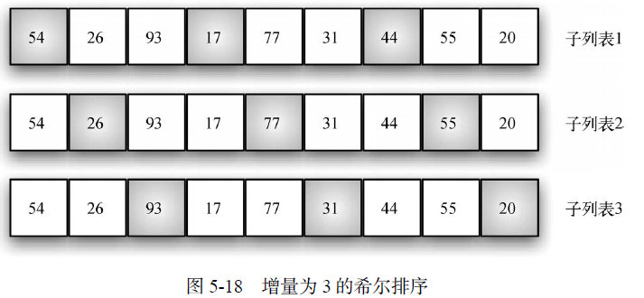

# 前期准备

## 1. 算法分析是什么

算法就是解决问题的方法

### 1.1. 优劣判断

<table frame=void>
    <tr>
        <td>
            <center>当两个看上去不同的程序解决同一个问题时，会有优劣之分么？
            </center>
        </td>
        <td>1. 代码可读性<br>
        	2. 资源利用的问题(空间)<br>
            3. 执行代码所需要的时间(时间)<br>
            <td></tr>
    <tr>
        <td><center>
            大O计数法
        </center></td>
        <td>
        	运行次数(解决问题所需步骤) --> 问题规模<br>
            用数量级(order of magn)来表示
        </td>
</table>

### 1.2. 异序词检测示例

* 例子：`heart`和`earth`

#### 清点法

```python
def todolistSolution(str1, str2):
    
```


# 基础数据结构

## 1. 线性数据结构

<table frame=void>
    <tr>
        <td colspan="3"><center>
            * 栈、队列、双端队列和列表都是有序的数据集合<br>
            * <b>线性数据结构：一旦某个元素被添加进来，它与前后元素的相对位置将保持不变。</b></center>
        </td>
    </tr>
    <tr>
        <td><center><a href="#stack">栈</a></center></td>
        <td><center>
            
            <br>
            <span>栈 以及 LIFO(Last in First out)</span>
            </center>
        <td>
            1. 添加/删除元素都在同一端，注意<span style='color:red'>LIFO原则</span><br>
            2. 例子：浏览器中的返回按钮。<br>最开始浏览的页面处于栈的底端，最新浏览的页面处于栈的顶端。
        </td>
    </tr>    
    <tr>
        <td rowspan='2'><center><a href="#queue">队列</a></center></td>
        <td colspan='2'>
            1. <a href="#one_queue">单端队列</a>添加在尾端，移除在首端，<span style='color:red'>FIFO原则</span><br>
        </td>
    </tr>
    <tr>
    	<td colspan='2'>
            2. <a href="#de_queue">双端队列</a>首尾都可以实现添加和移除<span style='color:red'>LIFO、FIFO原则</span><br>
            
        </td>
    </tr>
    <tr>
        <td rowspan='2'><center><a href="#list">列表</a></center></td>
        <td colspan='2'>
            1. <a href="#lianbiao">无序列表_链表</a>：无序列表需要维持元素之间的相对位置，但是并不需要在连续的内存空间中维护这些位置信息。<br>
            
        </td>
    </tr>
    <tr>
        <td colspan='2'>
            2. <a href="#liebiao">有序列表</a>：有序列表内部的值按数值大小进行排布，升序或者降序<br>
        </td>
    </tr>
</table>

### 1.1. <a name='stack'>栈</a>

#### 1.1.1. 抽象数据类型

* `Stack()`创建一个空栈。它不需要参数，且会返回一个空栈。
  `push(item)`将一个元素添加到栈的顶端。它需要一个参数item，且无返回值。
  `pop()`将栈顶端的元素移除。它不需要参数，但会返回顶端的元素，并且修改栈的内容。
  `peek()`返回栈顶端的元素，但是并不移除该元素。它不需要参数，也不会修改栈的内容。
  `isEmpty()`检查栈是否为空。它不需要参数，且会返回一个布尔值。
  `size()`返回栈中元素的数目。它不需要参数，且会返回一个整数。

* 使用list来实现，有两种方法：
  * 将list的尾巴当作栈的顶端，list的头当作栈的底端：使用`append()`和`pop()`实现
  * 将list的头当作栈的顶端，list的尾巴当作栈的底端：使用`insert(0, item)`和`pop(0)`实现

#### 1.1.2. 抽象数据结构实现

```python
class Stack:
    def __init__(self):
        self.items = []
    
    def isEmpty():
        return self.items == []
    
    def push(item):
        self.items.append(item)
    	return self.items
    
    def pop():
        self.items.pop()
		return self.items()
    
    def peek():
        return self.items[len(self.items)-1]
    
    def size():
        return len(self.items)
```

#### 1.1.3. 例子

##### 十进制转二进制


  ```python
  from pythonds.basic import Stack
  
  def divideBy2(decNumber):
      remstack = Stack()
      
      # 计算二进制
      while decNumber > 0:
          rem = decNumber % 2
          remstack.push(rem)
          decNumber = decNumber // 2
      
      # 输出二进制结果
      binString = ""
      while not remstack.isEmpty():
          binString = binString + str(remstack.pop())
      return binString
  ```

##### 转换成别的进制

* 如果进制数超过10，即需要另外构建10以外的基数，而`divideBy2()`是通过余数实现的。`baseConvert(decNumber, base)`实现十进制向任意进制的转换

  ```python
  from pythonds.basic import Stack
  
  def baseConvert(decNumber, base):
      digits = "0123456789ABCDEF"
      remStack = Stack()
      
      while decNumber > 0:
          rem = decNumber % base
          remStack.push(rem)
          decNumber = decNumber // base
      
      binString = ""
      while not remStack.isEmpty():
          binString += digits[remStack.pop()]
      return binString
  ```

##### 前、中、后序表达式

<table>
    <tr>
        <td><center>仅有中序表达式需要<b>()</b>以消除歧义，其他两者则不用</center></td>
        <td><center></center></td>
    </tr>
    <tr>
        <td><center>将中序表达式转换成其他次序的表达式</center></td>
        <td>  1.将中序表达式先转换成完全括号表达式<br>
			2.1. `中转前`：先将乘除号移动到**右**括号，再将加减号转移到更**右**的括号<br>
            <center></center><br>
			2.2. `中转后`：先将乘除号移动到**左**括号，再将加减号转移到更**左**的括号<br>
			<center></center></td>
    </tr>
    <tr>
        <td><center>例子：` (A + B) * C − (D − E) * (F + G)` </center></td>
        <td><center></center></td>
    </tr>
</table>


###### 1. 中序表达式转换成后序表达式代码

<table frame=void>
    <tr><td colspan='2'><center>
        
        </center>
        <center><b>将中序表达式<u>A * B + C * D</u>转换为后序表达式<u>A B * C D * +</u></b></center>
        </td>
    </tr>
    <tr>
        <td >
            <center>
                
            </center>
        </td>
        <td>
            <center>
                
            </center>
        </td>
    </tr>
</table>


```python
"""
(1) 创建用于保存运算符的空栈opstack，以及一个用于保存结果的空列表。
(2) 使用字符串方法split 将输入的中序表达式转换成一个列表。
(3) 从左往右扫描这个标记列表。
	* 如果标记是操作数，将其添加到结果列表的末尾。
	* 如果标记是左括号，将其压入opstack栈中。
	* 如果标记是右括号，反复从opstack栈中移除元素，直到移除对应的左括号。
 	  将从栈中取出的每一个运算符都添加到结果列表的末尾。
	* 如果标记是运算符，将其压入opstack栈中。
	  但是，在这之前，需要先从栈中取出优先级更高或相同的运算符，并将它们添加到结果列表的末尾。
(4) 当处理完输入表达式以后，检查opstack。将其中所有残留的运算符全部添加到结果列
表的末尾。
"""
```

```python
from pythond.basic import Stack
import string

def infix2Postdix(infixexpr):
    prec = dict("*"=3, "/"=3, "+"=2, "-"=2, ")"=1)
    opStack = Stack()
    postfixList = []
    
    tokenList = infixexpr.split()
    for token in tokenList:
        # 当输入是符号的时候，将其放到列表里
        if token in string.ascii_uppercase:
            postfixList.append(token)
        elif token == '(':
            opStack.push(token)
        elif token == ')':
            topToken = opStack.pop()
            while topToken != '(':
                postfixList.append(topToken)
                topToken = opStack.pop()
		else:
            while (not opStack.isEmpty()) and (prec[opStack.peek()] >= prec[token]):
                postfixList.append(opStack.pop())
			opStack.push(token)
	while not opStack.isEmpty():
        postfixList.append(opStack.pop())
	return " ".join(postfixList)
```

###### 2. 计算后续表达式

```python
"""
(1) 创建空栈operandStack。
(2) 使用字符串方法split 将输入的后序表达式转换成一个列表。
(3) 从左往右扫描这个标记列表。
 	如果标记是操作数，将其转换成整数并且压入operandStack 栈中。
 	如果标记是运算符，从operandStack 栈中取出两个操作数。第一次取出右操作数，第
	二次取出左操作数。进行相应的算术运算，然后将运算结果压入operandStack 栈中。
(4) 当处理完输入表达式时，栈中的值就是结果。将其从栈中返回。
"""
```

```python
from pythonds.basic import Stack
def postfixEval(postfixExpr):
    operandStack = Stack()
    tokenList = postfixExpr.split()

    for token in tokenList:
        if token in "0123456789":
            operandStack.push(int(token))
        else:
        operand2 = operandStack.pop()
        operand1 = operandStack.pop()
        result = doMath(token, operand1, operand2)
        operandStack.push(result)
    return operandStack.pop()

 def doMath(op, op1, op2):
 	if op == "*":
        return op1 * op2
 	elif op == "/":
 		return op1 / op2
 	elif op == "+":
 		return op1 + op2
 	else:
		return op1 - op2
```

### 1.2. <a name='queue'>队列</a>

#### 1.2.1. <a name='one_queue'>单端队列</a>

##### 抽象数据结构

* `Queue()`创建一个空队列。它不需要参数，且会返回一个空队列。
  `enqueue(item)`在队列的尾部添加一个元素。它需要一个元素作为参数，不返回任何值。
  `dequeue()`从队列的头部移除一个元素。它不需要参数，且会返回一个元素，并修改队列的内容。
  `isEmpty()`检查队列是否为空。它不需要参数，且会返回一个布尔值。
  `size()`返回队列中元素的数目。它不需要参数，且会返回一个整数。

##### 实现

```python
class Queue:
    def __init__(self):
        self.items = []
	
    def isEmpty(self):
        return (len(self.items) > 0)
    
    def enqueue(self, item):
    	self.items.insert(0, item)
        
	def dequeue(self):
        return self.items.pop()
        
	def size(self)
    	return len(self.items)
```

#### 1.2.2. <a name='de_queue'>双端队列</a>

##### 抽象数据结构

* `Deque()`创建一个空的双端队列。它不需要参数，且会返回一个空的双端队列。
  `addFront(item)`将一个元素添加到双端队列的前端。它接受一个元素作为参数，没有
  返回值。
  `addRear(item)`将一个元素添加到双端队列的后端。它接受一个元素作为参数，没有返
  回值。
  `removeFront()`从双端队列的前端移除一个元素。它不需要参数，且会返回一个元素，
  并修改双端队列的内容。
  `removeRear()`从双端队列的后端移除一个元素。它不需要参数，且会返回一个元素，
  并修改双端队列的内容。
  `isEmpty()`检查双端队列是否为空。它不需要参数，且会返回一个布尔值。
  `size()`返回双端队列中元素的数目。它不需要参数，且会返回一个整数。

##### 实现

```python
class Deque:
    def __init__(self):
        self.items = []
        
    def isEmpty(self):
        return self.items == []
    
    def addFront(self, item):
        self.items.insert(0, items)
    
    def addRear(self, item):
        self.items.append(item)
    
    def removeFront(self):
        self.items.pop(0)
    
    def removeRear(self):
        self.items.pop()
    
    def size(self):
        return len(self.items)
```

##### 回文检测器实现

```python
from pythonds.basic import Deque

def palchecker(aString):
    chardeque = Deque()
    
    for ch in aString:
        chardeque.addRear(ch)
	stillEqual = True
    
    while chardeque.size() > 1 and stillEqual:
        first = chardeque.removeFront()
        last = chardeque.removeRear()
        if first != last:
            stillEqual = False
	return stillEqual
```

### 1.3. 列表

#### 1.3.1. 无序列表：链表

##### 抽象结构：

* `List()`创建一个空列表。它不需要参数，且会返回一个空列表。
  `add(item)`假设元素item 之前不在列表中，并向其中添加item。它接受一个元素作为参数，无返回值。
  `remove(item)`假设元素item 已经在列表中，并从其中移除item。它接受一个元素作为参数，并且修改列表。
  `search(item)`在列表中搜索元素item。它接受一个元素作为参数，并且返回布尔值。
  `isEmpty()`检查列表是否为空。它不需要参数，并且返回布尔值。
  `length()`返回列表中元素的个数。它不需要参数，并且返回一个整数。
  `append(item)`假设元素item 之前不在列表中，并在列表的最后位置添加item。它接受一个元素作为参数，无返回值。
  `index(item)`假设元素item 已经在列表中，并返回该元素在列表中的位置。它接受一个元素作为参数，并且返回该元素的下标。
  `insert(pos, item)`假设元素item 之前不在列表中，同时假设pos 是合理的值，并在位置pos 处添加元素item。它接受两个参数，无返回值。
  `pop()`假设列表不为空，并移除列表中的最后一个元素。它不需要参数，且会返回一个元素。

##### <a name='lianbiao'>链表</a>

###### 1. 介绍：

* `isEmpty()`, `length()`, `travel()`, `add(item)`, `remove(item)`, `append(item)`, `insert(pos, item)`, `search(item)`
* 必须指明列表中第一个元素的位置
* 指向链表第一个元素的引用被称作**头**。最后一个元素需要知道自己没有下一个元素。

###### 2. Node类：

```python
"""节点类是链表的基础结构，链表通过节点的next来获取下一个节点的信息"""
class Node:
    def __init__(self, item):
        self.item = item
        self.next = None
```

###### 3. SingleLinkList类

```python
"""remove方法和search方法都不熟悉"""
```

```python
class SingleLinkList:
    def __init__(self):
        self.head = None
        
    def isEmpty(self):
        "判断链表是否为空"
        return self.head == None
    
    def length(self):
        "输出链表长度"
        cur = self.head
        count = 0
        while cur != None:
            count += 1
            cur = cur.next
		return count
    
    def travel(self):
        "遍历输出链表"
        cur = self.head
        while cur != None:
            print(cur.item)
            cur = cur.next
		print('finish')
	
    def add(item):
        temp = Node(item)
    	temp.next = self.head
        self.head = temp
        
    def append(item):
        temp = Node(item)
        "需要事先判断链表是否为空链表"
        if self.isEmpty():
            self.head = temp
		else:            
            cur = self.head
            while cur.next != None:
                cur = cur.next
            cur.next = temp
        
    def insert(pos, item):
        "插入的情况：插入头节点、插入尾节点、插入中间指定位置"
		if pos <= 0:
            self.add(item)
        elif pos >= self.length():
            self.append(item)
		
        else:
            temp = Node(item)
            bef = self.head
            count = 0
            """
            关于pos-1的解释：
            	因为如果要将item对应的节点插入到对应的pos上，需要获取pos-1的位置信息，
            	如果获取的是pos的位置信息，反而无法实现insert方法。
			"""
            while count < (pos-1):
                bef = bef.next
                count += 1
           	temp.next = bef.next
            cur.next = temp
            
    def remove(item):
        bef = None
        cur = self.head
        while cur != None:
            if cur.item == item:
                if not bef:
                    self.head = cur.next
                else:
                    pre.next = cur.next
                break
            else:
                pre = cur
                cur = cur.next
    
    def search(item):
        "查找链表中是否有想要查找的元素，返回布尔值"
        cur = self.head
        while cur != None:
			if cur.item == item:
                return True
            cur = cur.next
            return False
```

#### 1.3.2. <a name='liebiao'>有序列表</a>

##### OrderLinkList类

```python
class OrderLinkList:
    def __init__(self):
        self.head = None
        
    def isEmpty(self):
        "判断链表是否为空"
        return self.head == None
    
    def length(self):
        "输出链表长度"
        cur = self.head
        count = 0
        while cur != None:
            count += 1
            cur = cur.next
		return count
    
    def travel(self):
        "遍历输出链表"
        cur = self.head
        while cur != None:
            print(cur.item)
            cur = cur.next
		print('finish')
    
    def add(self, item):
        temp = Node(item)
        stop = False
        pre = None
        cur = self.head
        """定位, 升序链表"""
        while not stop and cur != None:
            if item < cur.item:
                stop = True
            else:
                pre = cur
                cur = cur.next
        """插入"""
        if pre == None:
            temp.next = cur
            self.head = temp
       	else:
            pre.next = temp
            temp.next = cur
        
   	def remove(item):
        bef = None
        cur = self.head
        while cur != None:
            if cur.item == item:
                if not bef:
                    self.head = cur.next
                else:
                    pre.next = cur.next
                break
            else:
                pre = cur
                cur = cur.next
    
    def search(self, item):
        cur = self.head
        stop = False
        while not stop and cur != None:
            if item == cur.item:
                return True
            else:
				if item < cur.item:
                    return False
                else：
                	cur = cur.next
		return False
```

## 2. 递归

<table>
    <tr>
        <span style='color:red; background:pink'>递归</span>是一种解决方法：
        <span style='color:red; background:#FFDADF'>不断将问题分解成更小的子问题，一直分解到子问题可以用普通的方法解决</span>，即函数自己调用自己
        <br>最重要的是<span style='color:red; background:#FFDADF'>确定基本情况</span>
    </tr>
    <tr>
        <td>
            递归三原则
        </td>
        <td>
            (1) 递归算法必须有基本情况；<br>
            (2) 递归算法必须改变其状态并向基本情况靠近；<br>
            (3) 递归算法必须递归地调用自己。<br>
        </td>
    </tr>
    <tr>
    </tr>
</table>


### 2.1. 最简单的递归函数

```python
"""递归列表求和"""
def sum_list(input_list):
    if len(input_list) == 1:
        return input_list[0]
    else:
        return input_list[0] + sum_list(input_list[1:])
```

### 2.2. 整数转换成2-16任意进制数的字符串

#### 用列表+递归实现

```python
def toStr(input_int, base):
    countString = "0123456789ABCDEF"
    if input_int < base:
        return countString[input_int]
    else:
        return toStr(input_inut//base, base) + countString[input_base%base]
```

#### 用栈+递归实现

```python
rStack = Stack()
def toStr(input_int, base):
    countString = "0123456789ABCDEF"
    if input_int < base:
        rStack.push(countString[input_int])
    else:
        rStack.push(countString[input_int % base])
        toStr(input_int // base, base)
```

#### 汉诺塔

```python
"""
有三个柱子abc，现在所有碟子都在a上面，想把碟子都移动到c上面
步骤就是：
	1. 把a中除了最大的碟子外，都移动到b上，再把a剩下最大的碟子移动到c上
	2. 现在将c当作过渡柱子，即，先把b中除了最大的碟子移动到a中，然后再把b中最大的盘子移动到c上
	3. 现在回到初始状态，重复步骤12
"""
def moveBiggest(fc, tc):
    print(f"moving disk from {fc} to {tc}\n")
    
def hannoi(height, fromCol, toCol, withCol):
    if height >= 1:
        hannoi(height-1, fromCol, withCol, toCol)
        moveBiggest(fromCol, toCol)
        hannoi(height-1, withCol, toCol, fromCol)
```

### 2.3. 动态规划-用找零作例子

#### 动态规划与贪心算法


#### 基础实现

```python
"""极大限度消耗计算资源，重复计算已有结果"""
def coinsChange(coinsValueList, change):
    min_coins = change  # 全部都用1块硬币找零
    if change in coinValueList:
        return 1
    else:
        needCoinValueList = [coin for coin in coinsValueList if coin < change]
        for i in needCoinValueList:
            num_coins = 1 + coinChange(coinsValueList, change-i)
            if num_coins < min_coins:
                min_coins = num_coins
        return min_coins
```

#### 减少重复计算

```python
"""
该方法是通过建立缓存的方法来优化计算算法性能
建立跟change等长的列表，用来存储已计算过的找零硬币数
列表长度可以用change//min_coin_value(即最小面额的零钱)
"""
def recDC(coinValueList, change, knownResult):
    min_coins = change
    if change in coinValueList:
        knownResult[change] = 1
        return 1
    elif knownResult[change] > 0:
        # 返回已计算过的找零数
        return knownResult[change]
    else:
        for i in [coin for coin in coinValueList if coin < change]:
            num_coins = 1 + recDC(coinValueList, change-i, knownResult)
            if num_coins < min_coins:
                min_coins = num_coins
                knownResult[change] = min_coins
	return min_coins
```

#### ==动态规划算法==

##### 1. 找零硬币最少问题

```python
class Solution:
    def coinChange(self, coins: List[int], amount: int) -> int:
        """没有记录用了什么硬币"""
        dp = [float("inf") for i in range(amount+1)] #初始化dp数组, 初始化为无穷大
        dp[0] = 0   # 当amount=0时，硬币所需数为0
        for i in range(1, amount + 1):
            for coin in coins:
                if i - coin >= 0:
                    dp[i] = min(dp[i], dp[i - coin] + 1)
        if dp[-1] == float("inf"):
            return -1
        else:
            return dp[-1]

class Solution2:
    """记录所用到的硬币以及输出硬币数量"""
    def dpMakechange(self, coins, amount):
        UsedCoins = []
        dp = [float("inf") for i in range(amount+1)] #初始化dp数组
        dp[0] = 0   # 当amount=0时，硬币所需数为0
        for i in range(1, amount+1):
            for coin in coins:
                if i - coin >= 0:
                    dp[i] = min(d[i], d[i-coin]+1)
                    UsedCoins.append(coin)
        if dp[-1] == float("inf"):
            return -1
        else:
            print("UsedCoins: {}".format(UsedCoins))
            return dp[-1]
```

##### 2. 最少硬币组成所有面值的问题


```python
class Solution:
    def coinChange(self, coins: List[int], amount: int) -> int:
        dp = [float("inf") for i in range(amount+1)] #初始化dp数组
        dp[0] = 0   # 当amount=0时，硬币所需数为0
        if 1 not in coins: # 如果硬币里面没有面值为1的硬币，则无法组成所有的硬币
            return -1 
        dp[1] = 1
        for i in range(2,amount+1):
            min_ = dp[i] 
            for j in range(1,i):
                if j in coins and j<=i-j+1:  # 如果另一部分直接可以用一个硬币代替
                    min_ = min(min_, dp[i-j]+1)
                else:
                    min_ = min(min_,dp[i-j]+dp[j])
            dp[i]=min_
        return dp[-1]      
```

## 3. 排序和搜索

> 顺序搜索、二分法搜索（分治策略）

| 搜索     | 时间复杂度 |      |
| -------- | ---------- | ---- |
| 顺序搜索 |            |      |
| 二分搜索 |            |      |
| 散列     |            |      |
|          | 再散列     |      |
|          | 平方散列   |      |

### ==排序==

* 都是==从小到大==排序	`list[0] ---- list[-1]是升序`

<table>
    <tr>
        <td>
            <center>
                <a name="bubule_sort_pic">第一次循环的冒泡法</a><br>
                
            </center>
        </td>
        <td>
            <center>
                <a name="select_sort_pic">"选择排序法"</a>                
                <br>
                
            </center>
        </td>
    </tr>
    <tr>
        <td>
            <center>               
                <a name="insert_sort_pic">"插入排序"</a>                
                <br>
                
            </center>
        </td>
        <td>
            <center>     
                <a name="hill_sort_pic">"希尔排序"</a>
                <br>
                
                
                
            </center>
        </td>
    </tr>
    <tr>
        <td>
            <center>
                <br>
                
                <a name="and_sort_pic">"归并排序"</a>
                <br>
            </center>
        </td>
        <td>
            <center>
                <br>
                <br>
                <br>
                
                <a name="quik_sort_pic">"快速排序"</a>
                <br>
            </center>
        </td>
    </tr>
</table>

#### 1. 冒泡法     				<a href="#bubule_sort_pic">图</a> 

```python
def bubble_sort(input_list):
    for residual_list in range(len(input_list), 0, -1): 
        for i in range(residual_list):
            if input_list[i] > input_list[i+1]:
                tmp = input_list[i]
                input_list[i] = input_list[i+1]                
                input_list[i+1] = tmp

"""特别是，如果在一轮遍历中没有发生元素交换，就可以确定列表已经有序。可以修改冒泡排序函数，使其在遇到这种情况时提前终止"""

# 修改后的冒泡法-----”短冒泡“
def short_bubble_sort(input_list):
    exchanged = True
    residual_list = len(input_list)-1
    while residual_list>0 and exchanged == True:
        for i in range(residual_list):
            if input_list[i] > input_list[i+1]:
                tmp = input_list[i]
                input_list[i] = input_list[i+1]
                input_list[i+1] = tmp
               	exchanged = True
		residual_list -= 1
```

#### 2. 选择排序     				<a href="#select_sort_pic">图</a>                

```python
def select_sort(input_list):
    for _length in range(len(input_list)):
        for i in range(_length, len(input_list)+1):
            tmp_min_pos = i
            if input_list[tmp_min_pos] > input_list[i+1]:
                tmp_min_pos = i+1
		input_list[_length], input_list[tmp_min_pos] = input_list[tmp_min_pos], input_list[_length]
```
#### 3. 插入排序                <a href="#insert_sort_pic">图</a>      

```python
"""
像打牌一样，分成左右两个序列，一边有序，一边无序
手牌是有序的，用抓到的牌，从手牌最后一张开始比较
"""
def insert_sort(input_list):
    for index in range(1, len(input_list)):
        cur = input_list[index]
        pos = index
        
        while pos > 0 and input_list[pos - 1] > cur:
            input_list[pos] = input_list[pos - 1]
            pos -= 1
        
        input_list[pos] = cur
```
#### 4. 希尔排序                 <a href="#hill_sort_pic">图</a>

```python
"""
希尔排序也称“递减增量排序”
将整个序列分成几个组，先进行组内排序，然后再进行插入排序
"""
def gap_insert_sort(input_list, start, gap):
    for cur in range(start + gap, len(input_list), gap):
        """向前比较，如果比前者小，就交换前移"""
        cur_value = input_list[cur]
        position = cur
        while position >= gap and input_list[position-gap] > cur_value:
            """如果前一个gap位置比当前位置要大，则交换，且将当前位置前移，继续向前比较"""
            input_list[position] = input_list[position-gap]
            position = position - gap
        input_list[position] = cur_value
    		
def shell_sort(input_list):
    sub_list_length = len(input_list)//2
    while sub_list_length > 0:
        """本轮循环是为了不断将大序列变成小序列"""
        for start_position in range(sub_list_length):
            gap_insert_sort(input_list, start_position, sub_list_length)
		sub_list_length = sub_list_length // 2
```

#### 5. 归并排序                <a href="#and_sort_pic">图</a>

```python
def mergeSorted(input_list):
    if len(input_list) > 1:
        mid = len(input_list) // 2
        rightList = input_list[:mid]
        leftList = input_list[mid:]
        
        i, j, k = 0, 0, 0
        while i < len(rightList) and j < len(leftList):
            """左右两个列表都不为空的时候"""
            if rightList[i] < leftList[j]:
                input_list[k] = rightList[i]
                i += 1	
			else:
                input_list[k] = leftList[j]
                j += 1
            k += 1		
            
        while i < len(rightList):
            """左列表为空"""
            input_list[k] = rightList[i]
            i += 1
            k += 1
            
        while i < len(leftList):
            """右列表为空"""
            input_list[k] = leftList[j]
            j += 1
            k += 1
```
#### 6. 快速排序                <a href="#quik_sort_pic">图</a>

```python
def quikSorted(input_list):
    current_quik_sort(input_list, 0, len(input_list)-1)

def current_quik_sort(input_list, first_pos, last_pos):
    """利用递归将列表切分，不断地将基准点放到它应该在的位置"""
    if first_pos < last_pos:
        split_point = base(input_list, first_pos, last_pos)
    current_quik_sort(input_list, first_pos, split_point-1)
    current_quik_sort(input_list, split_point+1, last_pos)

def base(input_list, first_pos, last_pos):
    """找到基准点应该在的位置，进行交换，并返回基准点的位置"""
    pivot_value = input_list[first_pos]
    
    left_mark = first_pos + 1
    right_mark = last_pos
    done = False
    
    while not done:
        while left_mark <= right_mark and input_list[left_mark] <= pivot_value:
            left_mark += 1
        while input_list[right_mark] >= pivot_value and left_mark <= right_mark:
            right_mark += 1
       	
        if right_mark < left_mark:
            done = True
       	else:
            input_list[right_mark], input_list[left_mark] = input_list[right_mark], input_list[left_mark]
    
    input_list[first_pos], input_list[right_mark] = input_list[right_mark], input_list[first_pos]
    
    return right_mark
```
## 4. 树

### 4.1.  概述

#### 树的属性：

1. 树是按层级构建的，越笼统就越靠近顶部，越具体则越靠近底部。
2. 一个节点的所有子节点都与另一个节点的所有子节点无关。
3. 叶子节点都是独一无二的。

#### 树的基本实现

```python
"""
实现树有两种方式，一种是列表中的列表，另一种是节点与引用
前者通过列表嵌套的方式实现；
后者是将每个节点当作一个类，类包含了下一个左右节点的指针，跟链表类似

下文仅用”节点与引用“实现
"""

"""
	BinaryTree()创建一个二叉树实例。
	getLeftChild()返回当前节点的左子节点所对应的二叉树。
	getRightChild()返回当前节点的右子节点所对应的二叉树。
	setRootVal(val)在当前节点中存储参数val 中的对象。
	getRootVal()返回当前节点存储的对象。
	insertLeft(val)新建一棵二叉树，并将其作为当前节点的左子节点。
    insertRight(val)新建一棵二叉树，并将其作为当前节点的右子节点。
""" 
class BinaryTree:
    def __init__(self, rootObj):
        self.key = rootObj
        self.leftChild = None
        self.rightChild = None
	
    def getLeftChild(self):
        return self.leftChild
    
    def getRightChild(self):
        return self.rightChild
    
    def setRootVal(self, val):
        self.key = val
    
    def getRootVal(self):
        return self.key
    
    def insertLeft(self, val):
        """这里跟链表的insert是一样的"""
        if leftChild is None:
            self.leftChild  = BinaryTree(val)
       	else:
            newTree = BinaryTree(val)
            newTree.leftChild = self.leftChild
            self.leftChild = newTree
    
    def insertRight(self, val):
        """这里跟链表的insert是一样的"""
        if leftChild is None:
            self.rightChild  = BinaryTree(val)
       	else:
            newTree = BinaryTree(val)
            newTree.rightChild = self.rightChild
            self.rightChild = newTree
```

### 4.2. 完全表达式

#### 解析树

```python
from pythond.basic import Stack
from pythond.tree import BinaryTree

def buildParseTree(fpexp):
    fpexp = fpexp.split
    parent_stack = Stack()
    eTree = BinaryTree('')
    parent_stack.push(eTree)
    curTree = eTree
    for i in fpexp:
        if i == "(":
            curTree.insertLeft('')
            parent_stack.push(curTree)
            curTree = curTree.getLeftChild()
        elif i is not in "+-*/)":
            curTree.setRootVal(eval(i))
            parent = parent_stack.pop()
            curTree = parent
        elif i is in "+-*/":
            curTree.setRootVal(i)
            curTree.insertRight('')
            parent_stack.push(curTree)
            curTree = curTree.getRightChild()
        elif i == ")":
            curTree = parent_stack.pop()
        else:
            raise ValueError("Unknown Operator: " + i)
	
    return eTree

"""利用递归的方法，计算上面的函数"""
def evaluate(parse_tree):
    operate_ = {'+': operator.add, '-': operator.sub,
               	'*': operator.mul, '/': operator.truediv}
    leftChild_ = parse_tree.getLeftChild()
    rightChild_ = parse_tree.getRightChild()
    
    if leftChild_ and rightChild_:
        fn = operate_(parse_tree.getRootVal())
        return fn(evaluate(leftChild_, rightChild_))
    else:
        return parse_tree.getRootVal()
```

#### 遍历树

##### 1. 前序遍历

```python
"""外部实现"""
def preorder(tree):
    if tree:
        print(tree.getRootVal())
        preoder(tree.getLeftChild())
        preoder(tree.getRightChild())

"""类内实现"""
class BinaryTree:
    def __init__(self):
        ...
    def preorder(self):
        print(self.getRootVal())
        if self.getLeftChild():
            preorder(self.getLeftChild())
        elif self.getRightChild():
            preorder(self.getRightChild())
```

##### 2. 后序遍历

```python
"""后序遍历求解析树"""
def postorder(tree):
    operate_ = {'+': operator.add, '-': operator.sub,
               	'*': operator.mul, '/': operator.truediv}
    left_, right_ = None, None
    
    if tree:
        left_ = postorder(tree.getLeftChild())
		right_ = postorder(tree.getRightChild())
        if left_ and right_:
            return operate_[tree.getRootVal()](left_, right_)
        else:
            return tree.getRootVal()
```

##### 3. 中序遍历

```python
"""
将print放在中间，实现输出完全表达式的形式
该种写法有多余的括号，需要修改
"""
def inorder_print_expression(tree):
    string_ = ""
    if tree:
        string_ = "(" + inorder_print_expression(tree.getLeftChild())
        string_ += str(tree.getRootVal())
        string_ += inorder_print_expression(tree.getRightChild()) + ")"
    return string_
```

### 4.3. 利用二叉堆实现优先级队列

* 实现优先级队列的经典方法是使用叫作**二叉堆**的数据结构。二叉堆的入队操作和出队操作均可达到O(log n)。
* 二叉堆学起来很有意思，它画出来很像一棵树，但实现时只用一个列表作为内部表示。二叉堆有两个常见的变体：最小堆（最小的元素一直在队首）与最大堆（最大的元素一直在队首）。
* 树的对数性质、

##### 二叉堆

<table>
    <tr>
        <td>
            <center>
                <a name="Bianry_Heap">二叉堆</a>
        	</center>
        </td>
        <td>
            <center>
                
        	</center>
        </td>
    </tr>
    <tr>
    	<td>
            <center>
                堆的有序性：
            </center>
        </td>
        <td>
            <center>
                对于每个堆来说，都是堆中的元素全小于（大于）父节点
            </center>
        </td>
    </tr>
</table>

```python
"""
 BinaryHeap()新建一个空的二叉堆。
 insert(k)往堆中加入一个新元素。
 findMin()返回最小的元素，元素留在堆中。
 delMin()返回最小的元素，并将该元素从堆中移除。
 isEmpty()在堆为空时返回True，否则返回False。
 size()返回堆中元素的个数。
 buildHeap(list)根据一个列表创建堆。
"""
class BinaryTree:
    def __init__(self):
        self.heapList = [0]
        self.currentSize = 0
    
    def insert(self, k):
        self.heapList.append(k)
        self.currentSize = self.currentSize + 1
        self.percUp(self.currentSize)  # 为了不破坏堆的有序性，将其与父节点相比较，将其向上移动
    
    def percUp(self, i):
        while i // 2 == 0:
            if self.heapList[i] < self.heapList[i//2]:
                self.heapList[i], self.heapList[i//2] = self.heapList[i//2], self.heapList[i]
            	i = i//2
    		else:
                break
                
    def findMin(self):
        pass
    
    def delMin(self):
        retval = self.heapList[1]
        self.heapList[1] = self.heapList[self.currentSize]
        self.currentSize = self.currentSize - 1
        self.heapList.pop()
        self.percDown(1)
        return retval
  	
    def percDown(self, i):
        while (2 * i) <= self.currentSize:
            """意思是：该堆存在右节点"""
            min_child = self.minChild(i)
            if self.heapList[i] > self.heapList[min_child]:
                self.heapList[i], self.heapList[min_child] = self.heapList[min_child], self.heapList[i]
        	i = min_child
	
    def minChild(self, i):
        """找到当前节点的两个子节点哪个更小，返回其索引"""
        if 2*i+1 > self.currentChild:
            return 2 * i
        else:
            if self.heapList[2*i] < self.heapList[2*i+1]:
                return 2 * i
            else:
                return 2 * i + 1
    
    def isEmpty(self):
    	return self.currenSize == 0
    
    def size(self):
        return self.current_size
    
    def build_heap(self, input_list):
        i = len(input_list) // 2
        self.currentSize = len(input_list)
        self.heapList = [0] + input_list[:]
        while i > 0:
            self.percDown(i)
            i -= 1
```

##### 最大堆(自己实现)

```python
```


##### 利用堆来排序(自己实现)

```python
```

### 4.4. 二叉搜索树

<table>
	<tr>
        <td colspan="2">
            <center>
        		我们感兴趣的不是元素在树中的确切位置，而是<span style="color:red">如何利用二叉树结构提供高效的搜索。</span>
            </center>
        </td>
    </tr>
    <tr>
        <td>
            <center>
                <a name="Bianry_Search_tree">二叉搜索树</a>
        	</center>
        </td>
        <td>
            <center>
                
        	</center>
        </td>
    </tr>
    <tr>
    	<td>
            <center>
                <span style="color:red">搜索树的性质：</span>
            </center>
        </td>
        <td>
            <center>
                小于父节点的键都在左子树中，大于父节点的键则都在右子树中。
            </center>
        </td>
    </tr>
</table>
##### `TreeNode`

```python
"""
 Map()新建一个空的映射。
 put(key, val)往映射中加入一个新的键–值对。如果键已经存在，就用新值替换旧值。
 get(key)返回key 对应的值。如果key 不存在，则返回None。
 del 通过del map[key]这样的语句从映射中删除键–值对。
 len()返回映射中存储的键–值对的数目。
 in 通过key in map 这样的语句，在键存在时返回True，否则返回False。
"""
```

```python
class TreeNode:
    """显式地将父节点记录为自己的一个属性"""
    def __init__(self, key, val, 
                 left=None, right=None, parent=None):
        self.key = key
        self.payload = val
        self.leftChild = left
        self.rightChild = right
        self.parent = parent
	
    def hasLeftChild(self):
        return self.leftChild
    
    def hasRightChild(self):
        return self.rightChild
    
    def isLeftChild(self):
        return self.parent and self.parent.leftChild == self
    
    def isRightChild(self):
        return self.parent and self.parent.rightChild == self
    
    def isRoot(self):
        return not self.parent
    
    def isLeaf(self):
        return not (self.leftChild or self.rightChild)
    
    def hasAnyChildren(self):
        return self.leftChild or self.rightChild
    
    def hasBothChildren(self):
        return self.leftChild and self.rightChild
    
    def replaceNodeData(self, key, value, lc, rc):
        self.key = key
        self.payload = value
        self.leftChild = lc
        self.rightChild = rc
        if self.hasLeftChild():
            self.leftChild.parent = self
		if self.hasRightChild():
            self.rightChild.parent = self
```

##### `BinarySearchTree`

```python
class BinarySearchTree:
    def __init__(self):
        self.root = None
        self.size = 0
        
	def length(self):
        return self.size
    
    def __len__(self):
        return self.size
    
    def __iter__(self):
        return self.root.__iter__()       
```

###### 增加键值

```python
def put(self, key, val):
        if self.root:
            self._put(key, val, self.root)
		else:
            self.root = TreeNode(key, val)
		self.size += 1
    
    def _put(self, key, val, currentNode):
        if key < currentNode.key:
            if currentNode.hasLeftChild():
                self._put(key, val, currentNode.leftChild)
            else:
                currentNode.leftChild = TreeNode(key, val, parent=currentNode)
		elif key > currentNode.key:
            if currentNode.hasRightChild():
                self._put(key, val, currentNode.rightChild)
			else:
                currentNode.rightChild = TreeNode(key, val, parent=currentNode)
		else:
            """当两个键值相等的情况"""
            
	def __setitem__(self, k, v):
        """
        重载'[]'运算符，使得可以通过 myTree['key']=val 
        """
        self.put(k, v)
```

###### 搜索键值

```python
    def get(self, key):
        if self.root:
            res = self._get(key, self.root)
            if res:
                return res.payload
            else:
            	return None
        else:
        	return None
    
    def _get(self, key, currentNode):
		if not currentNode:
            return None
        elif key < currentNode.key:
            return _get(key, currentNode.rightChild)
        elif key > currentNode.key:
            return _get(key, currentNode.leftChild)
        else:
            return curretntNode 
        
    def __getitem__(self, key):
        return self.get(key)
    
    def __contains__(self, key):
		"""检查树中是否有某个键"""
        if self._get(key, self.root):
            return True
        else:
            return False
```

###### 删除节点

<table>
    <tr>
        <td><center><a href="#no_child">待删除节点没有子节点</a></center></td>
    	<td>
            <center>
                
            </center>
        </td>
    </tr>
    <tr>
        <td><center><a href="#only_one_child">待删除节点只有一个子节点</a></center></td>
        <td>
            <center>
                
            </center>
        </td>
    </tr>
    <tr>
        <td><center><a href="#two_children">待删除节点有两个子节点</a></center></td>
        <td>
            <center>
                
            </center>
        </td>
    </tr>
</table>

```python
	def delete(self, key):
        if self.size > 1:
            """如果节点数>1"""
            node2Remove = self._get(key, self.root)
            if node2Remove.key == key:
                self.remove(node2Remove)
                self.size -= 1
        elif self.size == 1 and self.root.key == key:
            """如果节点数为1，且当前节点是查找的值"""
            self.root = None
            self.size -= 1
        else:
            raise KeyError("Error, key not in tree")
	def __delitem__(self, key):
        self.delete(key)
```

<a name="no_child">没有子节点</a> 

```python
	# 寻找后继节点
    """
    (1) 如果节点有右子节点，那么后继节点就是右子树中最小的节点。
    (2) 如果节点没有右子节点，并且其本身是父节点的左子节点，那么后继节点就是父节点。
    (3) 如果节点是父节点的右子节点，并且其本身没有右子节点，那么后继节点就是除其本身外父节点的后继节点。
	"""
    def findSuccessor(self):
        succ = None
        if self.hasRightChild():
            """如果有右节点，就从右节点里找左节点"""
            succ = self.rightChild.findMin()
		else:
            if self.parent:
                """如果有父节点"""
                if self.isLeftChild():
                    """且为父节点的左节点，那么后继节点就是其父节点"""
                    succ = self.parent
                else:
                    self.parent.rightChild = None	# 将当前节点先忽略，然后递归找到其他树的后继节点
                    succ = self.parent.findSuccessor()
                    self.parent.rightchild = self
	
    def findMin(self):
        current = self
        while current.hasLeftChild():
            current = current.leftChild
        return current
    
    def spliceOut(self):
        """移除节点"""
        if self.isLeaf():
            """当前节点是叶子节点"""
            if self.isLeftChild():
                self.parent.leftChild = None
			else:
                self.parent.rightChild = None
        
        elif self.hasAnyChildren():
            """当前节点有子节点的情况"""
            if self.hasLeftChild():
                """移动当前节点的左节点"""
                if self.isLeftChild():
                    self.parent.leftChild = self.leftChild
                else:
                    self.parent.rightChild = self.leftChild
                self.leftChild.parent = self.parent
        
            else:
                """移动当前节点的右节点"""
                if self.isLeftChild():
                    self.parent.leftChild = self.rightChild
                else:
                    self.parent.rightChild = self.rightChild
                self.rightChild.parent = self.parent
```

```python
	def remove(self, currentNode):
        if currentNode.isLeaf():
            if currentNode.isLeftChild():
                currentNode.parent.leftChild = None
            else:
                currentNode.parent.rightChild = None
                
       	elif currentNode.hasBothChild():
            succ = currentNode.findSuccessor()
            succ.spliceOut()
            currentNode.key == succ.key
            currentNode.payload == succ.payload
        
        else:
            if currentNode.hasLeftChild():
                """当前节点的子节点是左节点"""
                if currentNode.isLeftChild():
                    currentNode.leftChild.parent = currentNode.parent
                    currentNode.parent.leftChild = currentNode.leftChild
				elif currentNode.isRightChild():
                    currentNode.leftChild.parent = currentNode.parent
                    currentNode.parent.rightChild = currentNode.leftChild
                
                else:
                    currentNode.replaceNodeData(currentNode.leftChild.key,
                                                currentNode.leftChild.payload,
                                                currentNode.leftChild.leftChild,
                                                currentNode.leftChild.rightChild)
            else:
                """当前节点的子节点是右节点"""
                if currentNode.isLeftChild():
                    currentNode.rightChild.parent = currentNode.parent
                    currentNode.parent.leftChild = currentNode.rightChild
				elif currentNode.isRightChild():
                    currentNode.rightChild.parent = currentNode.parent
                    currentNode.parent.rightChild = currentNode.rightChild
                
                else:
                    currentNode.replaceNodeData(currentNode.rightChild.key,
                                                currentNode.rightChild.payload,
                                                currentNode.rightChild.leftChild,
                                                currentNode.rightChild.rightChild)
	
```

###### ==二叉搜索树的迭代器==

```python
	def __iter__(self):
        if self:
            if self.hasLeftChild():
                for elem in self.leftChild:
                    yield elem
            yield self.key
            
            if self.hasRightChild():
				for elem in self.rightChild:
                    yield elem
```


## 5. 图

# 总结

## 进制数转换的方法

### 1. 栈

### 2. 递归

# Leetcode


